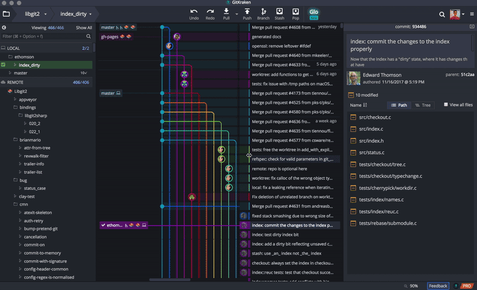

Git
====================

Git command-line
--------------------

Linux
********************

If you're on a ``RPM-based`` distribution::

    $ sudo dnf install git-all

If you're on a ``Debian-based`` distribution::

    $ sudo apt install git-all

Mac
********************

A macOS Git installer is maintained and available for download at the `Git website <http://git-scm.com/download/mac>`_

Windows
********************

Install `git for windows <https://gitforwindows.org/>`_

.. note:: This is a project called Git for Windows, which is separate from Git itself

Git GUI (cross-platform)
-----------------------------

Git is best used as a command line interface. Although git GUIs are not as powerful as the command line, it is still nice to be able to visualize your commit history. Git for windows comes with a GUI, but I recommend trying `GitKraken <https://www.gitkraken.com/download>`_ - it's cleaner and comes with a light and dark UI.

|gitkraken|

