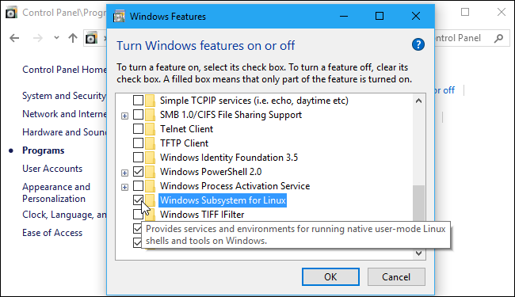
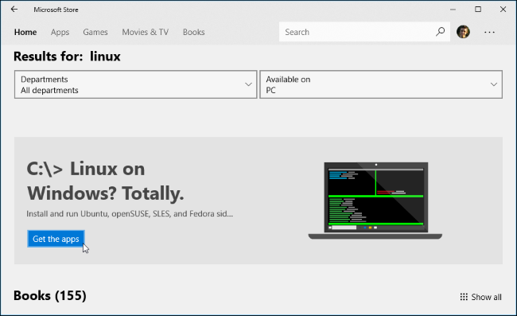

Linux/Unix and Bash
====================

Windows 10: Linux Subsystem for Windows
-----------------------------------------------

1. Control Panel -> Programs and Features and click "Turn Windows Features on or off" on the top left pane
2. In the dialog box, check "Windows Subsystem for Linux" and click Ok
    |unix_1|
3. Reboot machine
4. Start Menu -> Microsoft store -> Search for “Linux”
5. Click “Get the apps” under the “Linux on Windows?” banner
    |unix_2|
6. You’ll see a list of every Linux distribution currently available in the Windows Store. We recommend that you select “Ubuntu” (unless you know what you’re doing)
7. To open the Linux environment you installed, just open the Start menu and search for whatever distribution you installed. For example, if you installed Ubuntu, launch the Ubuntu shortcut
8. After installation it will ask to create a UNIX username and password
9. You are now ready to use the bash shell

Windows 8: Installing Babun
-------------------------------

Babun is just a customized and pre-configured Cygwin.  You can install Cygwin if you’re familiar with that.

1. Just download the dist file from `here <http://babun.github.io>`_, unzip it and run the ``install.bat`` script.
2. After a few minutes Babun starts automatically.
3. The application will be installed to the ``%USERPROFILE%\.babun`` directory.
4. Use the ``/target`` option to install babun to a custom directory.

Mac & Linux
--------------------

You default shell should already be bash.
Otherwise run: ``chsh -s /bin/bash``
