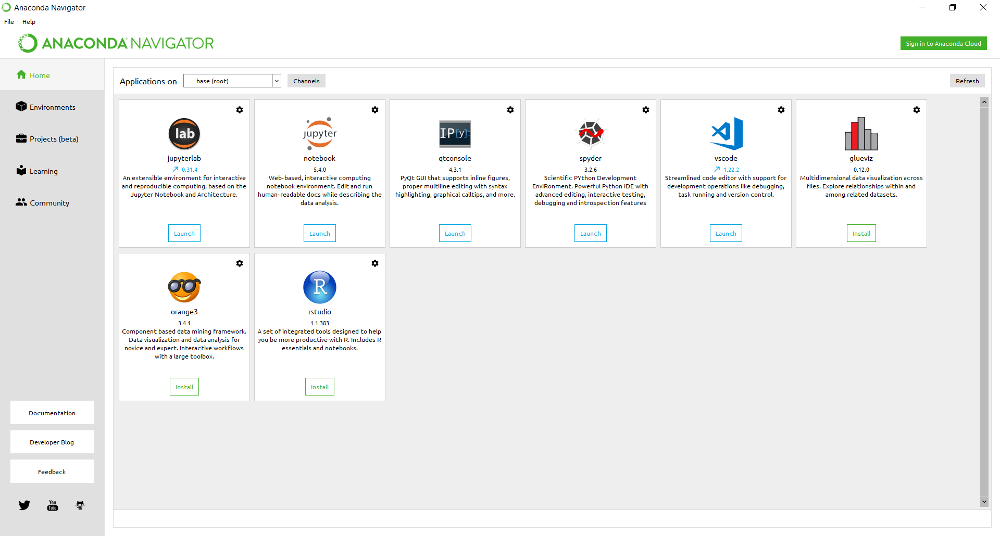

Python
====================

Anaconda
--------------------

To install Python, it is recommended to use the Anaconda distribution. Anaconda is a cross platform python distribution that packages useful tools for scientific programming in Python such as IDEs/text editors (Spyder/VSCode), package managing tools (pip/conda), interactive notebooks (Jupyter), and other useful tools. To install Anaconda use the following steps:

1. Go to https://www.anaconda.com/download/
2. It’s 2018, so make sure to download the Python 3.6 version. Python2 is rapidly being dropped from many important libraries, so Python3 is preferred.
3. During installation on Windows, you may be asked if you would like to add Anaconda to your PATH. This will make Anaconda packages/Python available across your computer, so it’s up to you whether this is something you want. Installation on MAC/Linux should be straight forward.
4. Once installation is successful, you will now have access to all the tools we need. To ensure everything installed properly, look for Anaconda Navigator in your applications. Launch the application, you should have a window that looks like this:
    |python|
5. If the button under Jupyter Notebook reads “Install” please click it to ensure Jupyter Notebooks are installed.
6. That’s it! You’re done!

