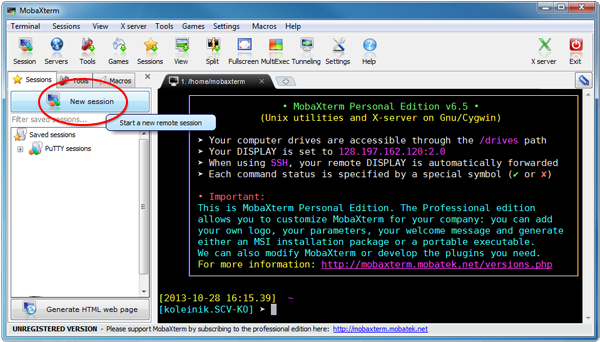
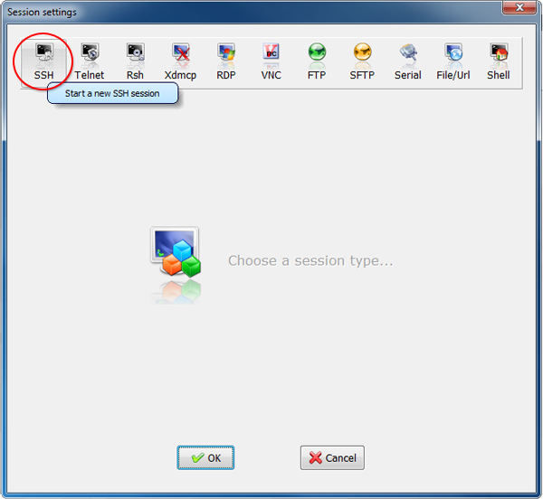
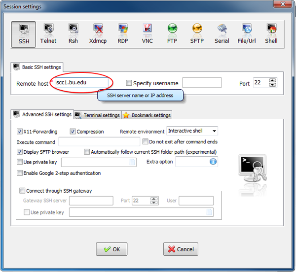
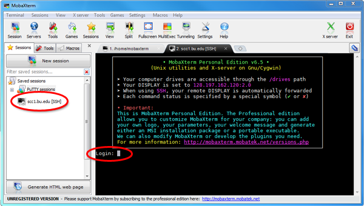
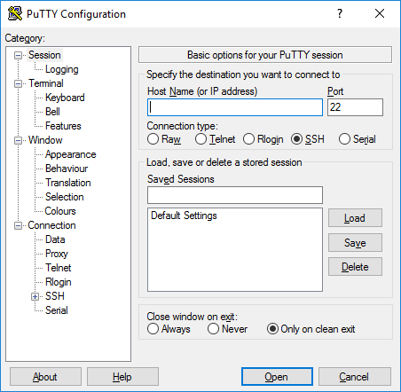
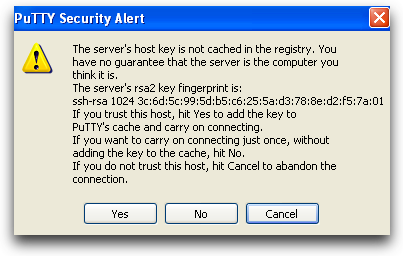

SSH Client
====================

In order to do anything on the Shared Computing Cluster (SCC) from your local computer, you first need to connect to the SCC using an SSH (Secure SHell) client. This task varies greatly based on your local operating system. Follow the SSH client installation instructions below depending on your operating system.

Windows
--------------------

Option 1 - Mobaxterm
***********************

SSH client with x-forwarding capabilities for graphic sharing

1. Download and install Mobaxterm from `here <http://mobaxterm.mobatek.net/>`_
2. Launch Mobaxterm and start a new session
    |ssh_1|
3. Select SSH as the session type
    |ssh_2|
4. Specify ``ssc1.bu.edu`` as the remote host and click “OK”
    |ssh_3|
5. Your connection will be saved on the left sidebar, so the next time you can start your session by clicking the “scc1.bu.edu [SSH]” link. In the terminal window you will get a prompt to enter your BU login information and password
    |ssh_4|

Option 2 - PuTTY
***********************

1. Download and Install `PuTTY <https://www.putty.org/>`_
2. Enter your connection settings
    - Host name: scc1.bu.edu
    - Port: 22 (leave as default)
    - Connection type: SSH (leave as default)

    |ssh_5|
3. Click Open to start SSH session
4. If this is your first time connecting to the server from this computer, you will see the following output. Accept the connection by clicking Yes
    |ssh_6|
5. Once the SSH Connection is open, you should see a terminal prompt asking for your username: username@scc1.bu.edu and then your password

Mac and Linux
--------------------

1. Use built-in terminal for both
2. *Mac option*: For X11-forwarding download `XQuartz <https://www.xquartz.org/>`_
3. To sign into the scc for Mac and linux, open a terminal
4. Use ssh to connect to the SCC with your login credentials in the terminal your_local_machine% ssh username@scc1.bu.edu
5. Enter BU kerberos password when prompted
6. Type exit to close session
