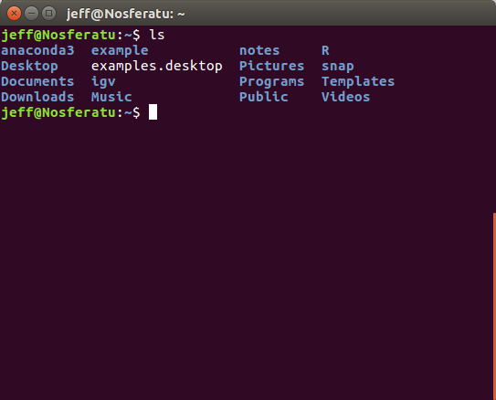
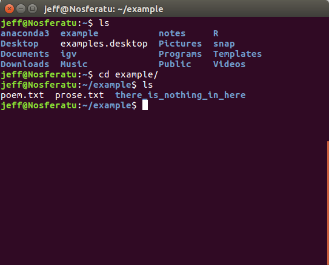
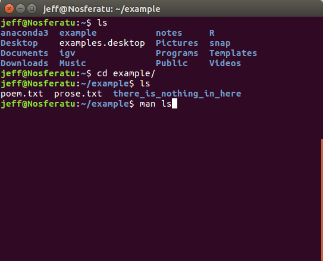
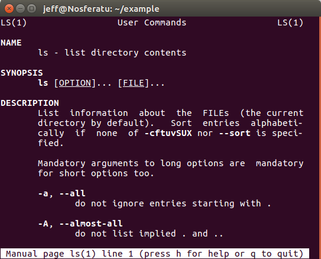

1. CLI intro 
====================

*Runtime ~ 5 min*

If you were able to open a terminal, you should see something like this:

.. image:: images/terminal.png
   
Most often, you will see your username, your current position in the file system, the "$" or "#" symbol and then a cursor.

Given this is a "command" line, type a command and then press enter!

   
I gave ``ls`` command, short for "list". This lists all of the files in the current directory. Because of my personal settings, directories are colored in blue and regular files are colored white. If you are ever playing around with your terminal settings, setting colors on will prove to be useful. Another command is the ``cd`` command:

   
By ``cd example``, what I'm doing is changing my *C*urrent *D*irectory to the directory to the one named example. Using ``ls``, I see that there are two files called ``poem.txt`` and ``prose.txt`` and a directory called ``there_is_nothing_in_here``. In the command ``cd example``, the ``cd`` is the command and ``example`` is considered the first argument for that command.

The next command is the ``man`` command, and it stands for manual. It takes a single argument, the name of a command:

   

You can press down, the space bar or page down to read down the manual, or up and page up to scroll back up. When you are done reading the manual, just press q and you'll be brought back to the command line. Most manuals have several sections:

Name - Gives the name of the command

Synopsis - The usage of the command is written in a short hand

Description - Gives a description of the purpose of the command

Options - Optional flags that the command uses

Examples - Example command are given

Author - The people who wrote the command's source code

Bugs - Known bugs/where to report bugs

Copyright - Who actually owns the source code

If we go down far enough on the ``ls`` manual, we'll see that the ``-l`` flag gives the output in long list format. Here's how you use flags:

 .. image:: images/man_ls-l.png

This lets you see a whole bunch of information about the files in the directory. Flags are just arguments and are often separated from other arguments by whitespace, such as a space. However, flags can be combined into a single argument as such:

 .. image:: images/man_ls-la.png

   
The ``-a`` flag lets you see hidden files and directories. Files become hidden by having the first character of their name be a ``.``!

Also, clicking tab will do an auto-complete if what you've written out is unique and in the right spot. For example, typing ``cd `` is enough in the example directory to hit tab and autocomplete ``there_is_nothing_in_here``, as there is no other directory in the current working directory to ``cd`` into. This works with commands as well, but commands tend to be short.

Woopdie doo, you can see files in a directory, go to nearby directories and look at manuals. You can do that with the file explorer GUI too. However, you'll come to see that the terminal can do a lot of the things that the GUI cannot do. If you are still having trouble, there are resources online that can help bolster your knowledge, such as this tutorial series: https://youtu.be/MmHcOPJEjGA .
