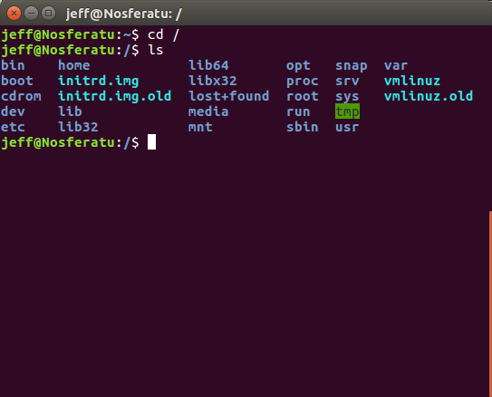
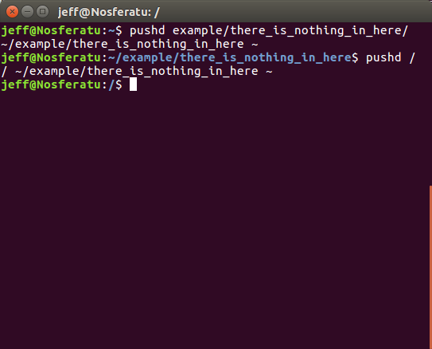
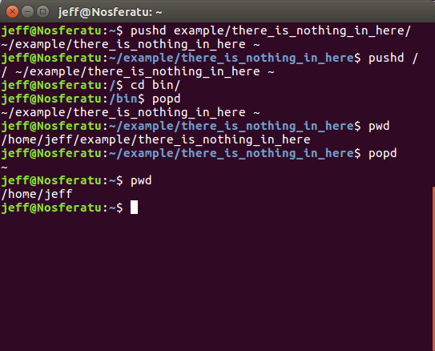
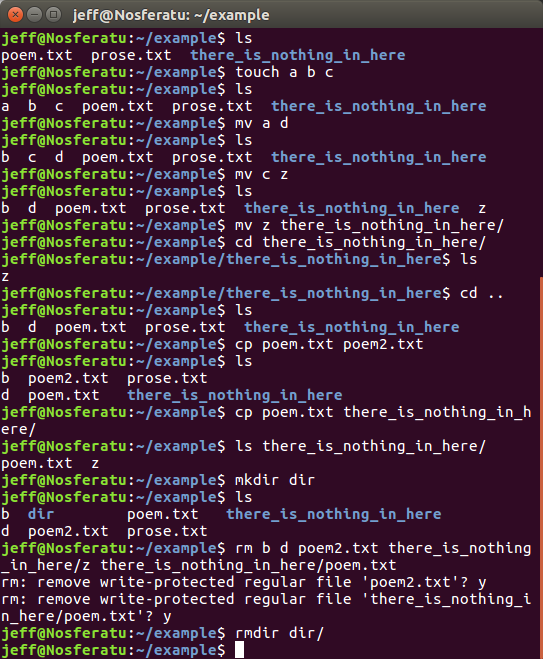
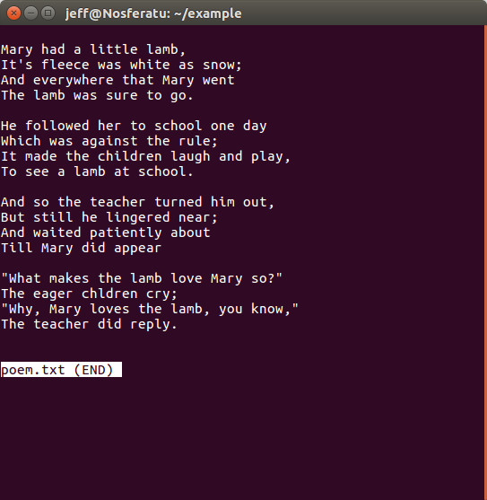

2. Navigation and File Operations
====================

Filesystem  *Runtime ~ 5 min*
  A filesystem is a structure that organizes how files are stored on the computer. In Unix, the two most basic objects are files and directories. Files can be things like text files or pictures. Directories contain files or other directories. Simple stuff.
  
  The base directory of the Unix file system is called root, and it is symbolized by a forward slash, ``/``. You can ``cd`` into it to see what's there.
  



Generally, all Unix systems have similar directories in their root directories. From there, you can ``cd`` into any directory that you have permission to enter. Now, remember how when we used ``ls -la`` there were two files there named ``.`` and ``..``? 

.. image:: images/man_ls-la.png

  
Well, ``.`` refers to your current directory and ``..`` refers to the one outside of your current directory. If you decide you want to go back up the filesystem, you can type ``cd ..``.
  
.. image:: images/cd_up.png

  
Navigation *Runtime ~ 10 min*
  The cd command is such a simple function that it doesn't even have a man page. It is not the only function that is used in navigating your filesystem, though. The ``pwd`` command outputs your current position:
  
.. image:: images/pwd.png

  
Not very exciting. 

There are more interesting ways to move from one place to another, for example, ``pushd``:




It seems to do exactly what ``cd`` does. It moves you from one place to another. However, you can then use ``popd`` to return to wherever you left using `pushd``:



  
Files  *Runtime ~ 5 min*

Let's go back to ``ls -l``:

.. image:: images/man_ls-la.png


So what are all of those columns? In order, they are the file/directory's permissions, number of links, the owner's name, the owner's group, the file size, the time of last modification and the file/directory name. Let's go one at a time:

- Permissions - This column describes who has permission to read (``r``), write (``w``) or execute (``x``) that file. The first value is whether the file is a directory or not. The next set of 3 characters is the permissions set for the person who made the file, the Owner. The next set describe the permissions of members of the group that the Owner is a part of. The last set of values is the permissions to anybody else. If a directory is not executable by you, you may not enter it. If a directory is not readable by you, you may not ``ls`` the directory to read its contents.
- Number of links - 1 for files, directory has 1 for each file or directory they are directly near, including themselves
- Owner - The person who owns the file, generally the person who made it
- Group - The Owner's group
- File size - In bytes
- Time of last modification - Month day year
- File name - It will be appropriately colored if you have the terminal settings. Filenames can be up to 256 characters long and can use any characters except the null character and the forward slash. However, please don't use whitespace and non-alphanumeric symbols besides period, underscore and hyphen. Most other characters have special meanings, so trying to work with such a file will be difficult.

These values are all stored in what is known as an inode table, one for each file in the filesystem. This is not important for now, but just know that an empty file can still take up space on the server. 

As hinted at before, some files can be executed. These files are known as executable, and can be activated like this:

.. image:: images/executable.png

  
Notice how only ``./hello_world.py`` and ```pwd`/hello_world.py`` were able to run the program. There are a few ways to run an executable. Using ``./`` syntax is most reliable. Without it, the computer will look at what's called a PATH variable and try to find something with that name in the PATH variable's list. Instead, ``./`` tells the computer "hey, it's in this directory. Don't go elsewhere."

File Operations  *Runtime ~ 10 min*

More commands!

- ``touch`` - Sees if each argument is the name of a file. If so, it "touches" it and does nothing. If a file does not exist with that name, it will make an empty file with that name.
- ``mv`` - Stands for "move." If the first argument is a file and the second is a directory, then that file is moved into that directory. If the name of the second argument doesn't exist, then ``mv`` will simply rename the file/directory at argument 1 to the second. Careful, it's very easy to clobber\* files!
- ``cp`` - Stands for "copy." Copies a file(s) from one place to another and can specify what the copy's name is. Careful, very easy to clobber*.
- ``mkdir`` - "Make a directory." Whatever arguments you give it, if a directory doesn't exist with that name, then it will make it. You are safe from clobbering* with this one--it will throw an error if you try to do something wrong.
- ``rm`` - "Remove." Removes whatever files. Will not remove a file you do not own. Be very, very careful when using this.
- ``rmdir`` - "Remove directory."  Removes the specified empty directories (directories that do not contain any files) you give it.

\*clobber - to overwrite




What if you want to change the permissions of a file? There are commands for that:

- ``chmod`` - "change file mode bits." Basically, you get to change permissions to files that you can modify. There's a few syntax that you can use, but if you remember your binary, you can use the synatax shown.
- ``chown`` - "change owner." Simple enough.

.. image:: images/file_permissions.png


This is where 1 is execute permissions, 2 is write permissions and 4 is read permissions. Thus, 764 means that the user can do all three (1+2+4), the group can read and write (2+4) and anybody else can only read (4).

All right, you can see and change a lot of a file's metadata, but how about its content?

- ``cat`` - "Concatenate." Will concatenate the content of the files given as arguments and print the entire content of a file(s) to the screen.

.. image:: images/file_stuff_cat.png

  
- ``head`` - Prints the first 10 lines of the files. You can also set how many lines you want it to print out instead of 10.
- ``tail`` - Prints the last 10 lines of the files. You can also set how many lines you want it to print out instead of 10.

.. image:: images/file_stuff_coin.png

  
- ``less`` - Gives you the contents of a file one page at a time. Will sometimes allow you to read a compressed file without uncompressing it first.

.. image:: images/file_stuff_less1.png

  


