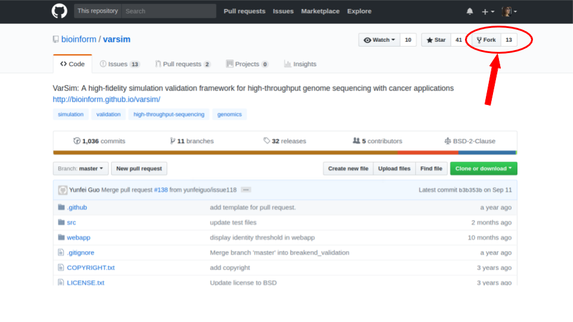

=====================================
Workshop 2: SCC and git
=====================================

Part 2.1: SCC and qsub
--------------------------------

Login into SCC
####################

.. code:: bash

   ssh [username]@scc1.bu.edu

Loading modules
####################
SCC has many preinstalled programs and utilities which we refer to as modules.
You can search for different modules using:

.. code:: bash

   module avail [pattern]
   
To load a specific module use module load:

.. code:: bash

   module load [module_name]
   
For example let's check for all the available JAVA versions on SCC and load version 9.

.. code:: bash

   module avail java
   module load java/9.0.1
   java -version

Submitting jobs to the SCC
############################
When you ``ssh`` to the SCC you are connected to a head node. 
Head nodes are the only nodes on the cluster that are connected to the internet (so that you can access the SCC).
They are the busiest and maintain all user connections. We should not run any program on the head node. 
By default your program will be killed if it runs more than 20 minutes, 
but even if you have some code that runs in 5 minutes, do not run it on the head node and always submit it as a job.

.. code:: bash

   qsub -P [project_name] -N [name_of_job] [bash_script]

When a job is running the standard output of it will be saved in a file names ``[job_name].o[job_ID]`` and the standard error output will go to ``[job_name].e[job_ID]`` in the directory you called ``qsub``. To merge them use ``-j y`` (join=yes). 
For a full list of parameters and option for qsub see 
`here <http://www.bu.edu/tech/support/research/system-usage/running-jobs/submitting-jobs/>`_. 
You can see how to allocate more memory, multiple processes to multi-threaded jobs, send notification emails upon the completion of your job, ...
Note the machines and resources available.

**Useful parameters**

- Send an email upon ending: ``-m e -M [email]``
- Get multiple processes/slots: ``-pe omp [#processes]`` 
- Set the maximum(hard) running time: ``-l h_rt=hh:mm::ss``

Once the job is given the resources it requires you can check the status of your ongoing jobs using ``qstat``:

.. code:: bash

   qstat -u [username]
   
This will return all the running jobs with their job_ID, name, starting time, and status (qw=waiting, r=running).

To delete/stop a job use ``qdel``.

.. code:: bash

   qdel [job_ID]

Useful tips
*************
- Always use a meaningful name for your jobs. In general always use meaningful names!
- Do not allocate more resources than you need. This will not make your program run faster. If your program is not meant to be multi-threaded or asking for too much memory when your program is not memory expensive, allocating more than one process just makes you wait longer in the queue. In general, don't be wasteful!
- You can use ``j_hold`` to make one job to wait for another one to finish then run. If the job is running the machine associated to it will be shown too. You can ssh to that machine and see the status of that job, too. Use ``top -u [username]`` to see your ongoing processes and the amount of resources they use.

Hands on activity
###################

Here we will do an activity.
`SRA toolkit <https://www.ncbi.nlm.nih.gov/sra/docs/>`_ is a useful tool used to download sequencing data from `GEO <https://www.ncbi.nlm.nih.gov/geo/>`_.
Here we will use the toolkit to download some RNASeq data.

**Log on to SCC.**

.. code:: bash

   ssh [username]@scc1.bu.edu
   
**Choose some RNAseq data**
First `Query for a series <https://www.ncbi.nlm.nih.gov/geo/browse/?view=series>`_ on GEO.
For example the `GSE113476 series <https://www.ncbi.nlm.nih.gov/geo/query/acc.cgi?acc=GSE113476>`_ contains human breast cancer PDX samples.
Get the SRA project (SRP) accession ID (`SRP141444 <https://www.ncbi.nlm.nih.gov/sra?term=SRP141444>`_) in the relations box.
To download this project, we need to get all the sample files (with SRR accession IDs). 
To do so use `SRA Run Selector <https://www.ncbi.nlm.nih.gov/Traces/study/>`_ and search project SRP141444. 
Get the accession list (SRR for each sample). Save it as a file on SCC either with filezilla or just vim.

.. code:: bash
   
   vim SRR_Acc_List.txt
   
Copy the first four SRR IDs into the file and save it:

.. code:: bash
   
   SRR7050666
   SRR7050667
   SRR7050668
   SRR7050669

**Load sra toolkit.**
See what versions of the toolkit are available.

.. code:: bash

   module avail sra

Load the default version.

.. code:: bash

   module load sratoolkit
 

**Make a bash script to download it.**
Make a script to read the SRR accession IDs one by one and fastq-dump them into a directory.

.. code:: bash

  #!/bin/bash
  ACCESSION_LIST_FILE=$1
  OUTPUT_DIR=$2
  while read SRR_ID; do
     fastq-dump --gzip --split-files --outdir $OUTPUT_DIR $SRR_ID
  done < $ACCESSION_LIST_FILE
 

**Submit the code.**

.. code:: bash

   qsub -N SRA_example dl_sra.sh SRR_Acc_List.txt SRP141444

Check qstat to see if your job is running.

This will download each SRR one by one. That is slow. Let's kill it (``qdel``) and make it faster.

**Make your code multi-processed to run faster.**

You can make it multi processing (especially when you need to use large numbers of processes) is to use multiple jobs.
Try that on your own. Make a bash script that sends a query (``qsub``) for each SRR accession.
   

Part 2.2: Version control with git
-------------------------------------

Forking a repository
############################

On `Bitbucket <https://confluence.atlassian.com/bitbucket/forking-a-repository-221449527.html>`_ you can fork from the left menu:

.. image:: images/fork_atlassian.gif
   :target: https://confluence.atlassian.com/bitbucket/forking-a-repository-221449527.html

On `GitHub <https://help.github.com/articles/fork-a-repo/>`_ on the top left you can find the fork button.

You will be divided into groups. One person from each team forks the repository.

- Fork the repository. 
- Go to your copy of the repository.
- Click on **Send invitation** and then **Manage this repository**.
- Add your team members and give them **Admin** access.

Each team member will clone the repository on SCC.

**Editing from the server**

Go to the Bitbucket website, and find your repository.
Go to **Source**, and open the Readme file.
Click **Edit** to make changes to the Readme, and write your name.
Click the **Commit** button to save your changes.

**Running the code**

Read the **Readme** file. You will need to have Python3 and all the required modules installed.
If you don't already have a ``conda`` environment, use:

.. code:: bash

   module load anaconda2
   conda create --name [env_name] python=3.6.2
   source activate [env_name] 
 
We are going to use Python3, so make sure you create an environment accordingly.
You can check your Python version using:

.. code:: bash

   python -V

We will need to install some modules in order to run the code.

.. code:: bash

   # install the required libraries
   conda install scikit-learn
   conda install matplotlib
   pip install textblob
   python -m textblob.download_corpora

You can run the code now and play around.

.. code:: bash

   python src/digit_recognition_game.py
   python src/predict_sentiment.py

**Untracked directory**

When you run the code, a log file called *human_vs_machine.cvs* is made, which stores information for each run. You do not want the content of your runs to be uploaded to the repository. To do so, you can make a ``.gitignore`` file in the data folder.

.. code:: python

   vim .gitignore
   ls -a data

**Make some changes on digit_recognition_game.py**

``src/digit_recognition_game.py`` : runs a small code to learn handwritten digits from low resolution pictures. Then it will compete with you to see who can do better!!!
You will make the following changes to improve the code:

Start by entering your own name in line 2 of the ``src/digit_recognition_game.py`` file and commit your changes:

You can see which files you have changed  by:

.. code:: bash
    
   git status
   
and you can see the difference between the files, e.g. the lines that were changed by:

.. code:: bash
    
   git diff

Push it to the server:

.. code:: python
    
    git add src/*
    git commit -m "[your message]"
    git push

Did some of your team members get an error message?

.. code:: bash
   
    ! [rejected]        master -> master (non-fast-forward)
    error: failed to push some refs to 'https://[your_username]@bitbucket.org/[owner_repository]/bub_workshop07_git.git'
    To prevent you from losing history, non-fast-forward updates were rejected
    Merge the remote changes before pushing again.  See the 'Note about
    fast-forwards' section of 'git push --help' for details.

**Resolving conflicts**

If you got a conflict message, try to pull the recent changes made by others. 

.. code:: bash
  
   git pull   

This will try to automatically merge the changes that do not conflict. 
However, if there is a conflict, you will get an error message and in the file/s the conflicts will be marked.
Such as:

.. code:: bash
   
   <<<<<<< HEAD
   aaaaaaa
   =======
   bbbbbb
   >>>>>>> 38b76457af9eba704534f7293817653888c03fc5

If you don't want to merge and just get rid of all the changes you have made, you can use ``git stash``.
All your changed will be lost.

**Try this on your own**

Now let's improve the code a bit.

- Change A1. Allow the user to choose the learning algorithm. Currently the program supports Support VEctor Machines (SVM), Naive Bayes (NB), and K-nearest neighbors (KNB) classifiers. Prompt the user a number 1-3 to pick the classifier.

   .. code:: python
   
    def set_classifier(clf='KNN'):
        """ Set the type of classifier to use"""
    
        # Define ML classifier algorithms we are going to test out
        if classifier == "SVM":
            classifier = svm.SVC(kernel="linear")  #support vector machine()
        elif classifier == "KNN":
            classifier = neighbors.KNeighborsClassifier(9)  #K Nearest-Neighbors
        elif classifier == "NB":
            classifier = naive_bayes.GaussianNB()  #Naive Bayes
        else:
            classifier = neighbors.KNeighborsClassifier(9)  #K Nearest-Neighbors
    
        return classifier

- Change A2. check that the user enters a digit between 0 to 9. If the input is not a one digit number, warn the user and prompt for another number. 

   .. code:: python
   
      def get_human_prediction():
        """ 
        Function: Prompts the user for the number they are guessing.
        Returns: (int) number user guessed
        """
        human_prediction = None
        while human_prediction == None:
           try:
               human_prediction = input("Type the number your saw: ")
               human_prediction = int(human_prediction)
           except:  #except all errors and reset the variable so the user can be prompted again
               human_prediction = None
        return human_prediction

- Change A3. As you can see the image of the figure opens in a large size. Can you change this so it opens in a smaller size? 

   .. code:: python
   
      fig, ax = plt.subplots(figsize=(3, 3))
      

Try to push and resolve your conflicts again.

**Revert changes (undoing the commit)**

.. code:: bash
   
   git reset HEAD

You can do a ``--soft`` or a ``--hard`` reset.
Oh no, did all your changes disappear? 
We can move back and forward with git.
Get the ID of any commit and you can time travel.

.. code:: bash
   
   git reset d656972

Branching and merging 
#######################

You can make branches to work separately on different functionalities of a tools. 
This is useful for big teams of developers where each one works on a different module.
This is how you make a branch:

.. code:: bash
   
   # make a branch for your team
   git branch [your_branch]
   git checkout [your_branch]

Or you could make a branch and checkout at the same time.

.. code:: bash

   git checkout -b [your_branch]

See what branch you are on:

.. code:: bash

   git branch
 
You have your own local copy on a separate branch.

**Make some changes on predict_sentiment.py**

``src/predict_sentiment.py`` runs a small code to learn the sentiment (positive or negative) of a sentence from a set of training sentences and tests on a another set. Make the following changes:

- Change B1. The train and test sentences are currently hardcoded in the code. Save them into two text files ``train.txt`` and ``test.txt`` file and make the program read the data from the disk.

   .. code:: python
   
      def load_data_from_csv(filename):
      """ 
      Load data from a 2 column CSV file
      The data should have the a sentence in column 1
      and the sentiment "positive" or "negative" in column 2
      """
      f = open(filename,'r',encoding='latin-1')
      data = []
      for line in f:
         line = line.strip()
         sentence, sentiment = line.split(',')
         data.append( (sentence,sentiment) )
      return data

- Change B2. After learning the sentiments, make the program prompt sentences from the user and guess the sentiment. 

   .. code:: python
   
      input_sentence  = input("Type a new sentence: ")
      new_sentence = TextBlob(input_sentence,classifier=cl)
      print ("New sentence: %s" % new_sentence)
      print ("Predicted Connotation: %s" % new_sentence.classify())

Push your changes on your own branch.
There should be no conflicts.

**Merge the branch into master**

.. code:: bash

   git checkout master
   git merge [your_branch]

Hopefully you won't have conflicts. If you do, you know how to solve it.

**Pull requests**

You can inform other's of you magnificent changes and accomplishments by making pull requests. 
This way you let everyone know that you made some changes and they need to pull.

Go to the repository, from the left side menu click on **Pull requests**. 
Create a new pull request.
Note: It is better to send pull requests on branches, the changes you have been making.
