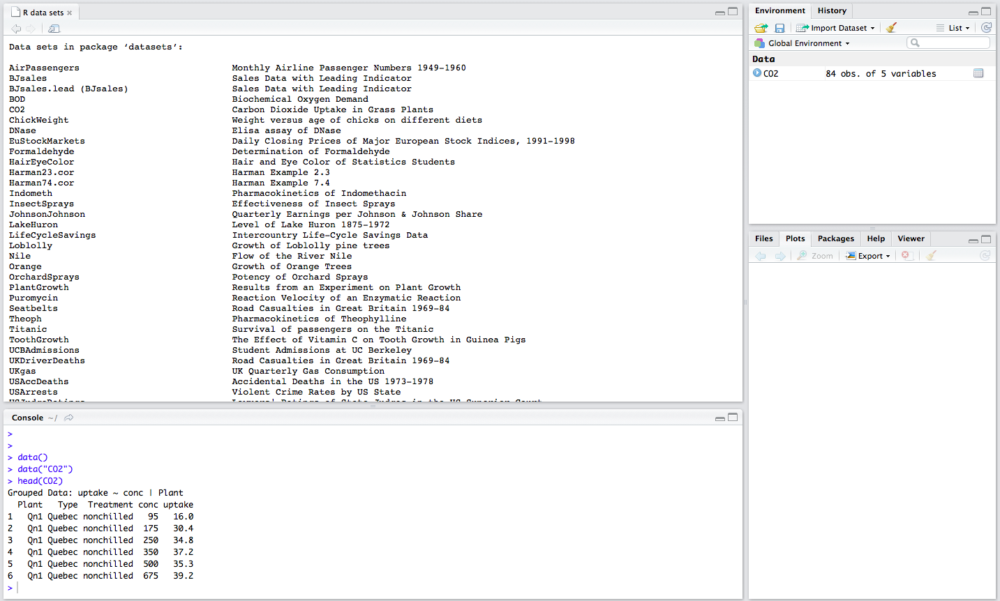
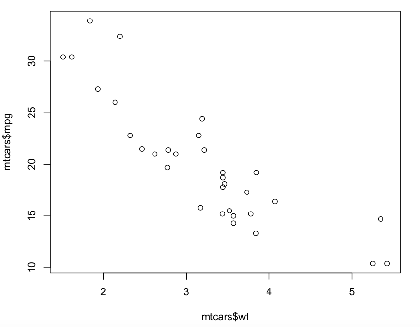
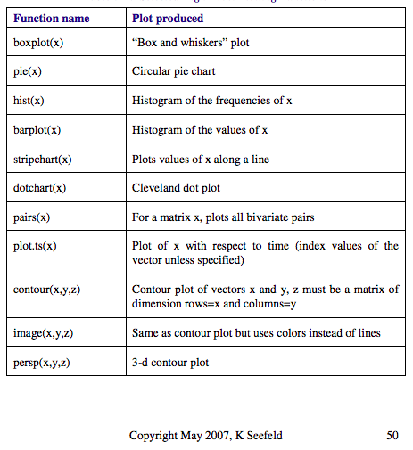
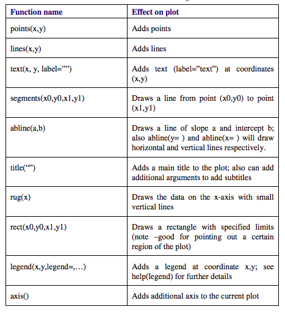

Exploring Data in R
===========================

In this section we will go into more detail as to how to import and explore data through different packages,functions, and graphics.

========================
R packages and libraries
========================

R packages are collections of functions and data sets developed by the R community. The main repository used in R is CRAN which has over 10,000 packages published and more that are publicly available. 

To install most packages, the function install.packages("package_name") can be used. 

There are other repositories such as Bioconductor that are used in Bioinformatics and other fields. 

To learn how to install packages, read a quick description about `package installation <https://www.tutorialspoint.com/r/r_packages.htm>`_ and watch a tutorial `here <https://www.youtube.com/watch?v=0cCuHhfphtQ>`_.

=====================
Loading Data
=====================

**************************
Importing downloaded data
**************************

Based on the data object, there are different functions available to import datasets into R. A cheatsheet from Rstudio community is provided below with useful functions to load in data.

.. image:: images/Import_Cheatsheet.pdf

An alternative way to import downloaded data is to also click on "Import Dataset" on the upper right hand side under Environment. 

.. image:: images/Rstudio_Console.png

In addition, datasets that are available online can be imported into R using their url. 

For example

.. code:: R

	#install and load data.table library
	install.packages("data.table")
	library(data.table)

	#Use fread function to download data set under the variable mydat
	mydat <- fread('http://www.stats.ox.ac.uk/pub/datasets/csb/ch11b.dat')
	

.. code:: R

	head(mydat)

		V1  V2   V3    V4 V5
	1:  1 307  930 36.58  0
	2:  2 307  940 36.73  0
	3:  3 307  950 36.93  0
	4:  4 307 1000 37.15  0
	5:  5 307 1010 37.23  0
	6:  6 307 1020 37.24  0

*************************
Available data sets in R
*************************

R has many available datasets that can be loaded using the function data().
Typing data() in the console provides a list of datasets and their descriptions.

.. image:: images/Dataset.png

We can load these data sets with the function load().
To look at the first few lines of the data set, we can use the function head(). To see the last few lines of the data set, we can use the function tail().

****************************
Saving Data Object and Files
****************************

We can save objects using the save() function.

For example, if we loaded the mtcars dataset from data() function in R, we can then save mtcars object by specifying the object (mtcars) and the file path with an .RData extension. Note, we can save more than one data object in a .RData file.

.. code:: R

	#load mtcars data set
	data("mtcars")

	#View mtcars dataset
	head(mtcars)

		                   mpg cyl disp  hp drat    wt  qsec vs am gear carb
	Mazda RX4         21.0   6  160 110 3.90 2.620 16.46  0  1    4    4
	Mazda RX4 Wag     21.0   6  160 110 3.90 2.875 17.02  0  1    4    4
	Datsun 710        22.8   4  108  93 3.85 2.320 18.61  1  1    4    1
	Hornet 4 Drive    21.4   6  258 110 3.08 3.215 19.44  1  0    3    1
	Hornet Sportabout 18.7   8  360 175 3.15 3.440 17.02  0  0    3    2
	Valiant           18.1   6  225 105 2.76 3.460 20.22  1  0    3    1

.. code:: R

	#save mtcars in .RData extension
	save(mtcars, file = "mtcars.RData")

To load this file into R, we can use the load() function.

.. code:: R

	load(file = "mtcars.RData")

Another way to save one data object is to save it using a .RDS extension. To save and load a .RDS extension, we can use saveRDS() function and readRDS() function.

.. code:: R

	#save mtcars to a .RDS file
	saveRDS(mtcars, file = "mtcars.rds")

	#read in .RDS file and save under mtcars variable name
	mtcars <- readRDS(file = "mtcars.rds")

To write an R object or variable to a file, we can use existing functions to write mtcars to a csv file and txt file. 

.. code:: R

	write.csv(mtcars, file = "mtcars.csv")

	write.table(mtcars, file = "mtcars.txt", sep="")

=======================
Data Exploration
=======================

***********************
Data Summary Functions
************************
Common functions used to initially explore data include functions for mean and standard deviation. In addition, we can use the summary() function to give us some descriptive statistics about a data set. 

.. image:: images/Data_Exploration.png

**************
Manipulating Data
**************

We can use packages to reshape or clean our data prior to analysis. Two main packages that are used are tidyr and reshape2. 

To learn more about how to use these package to tidy and reshape data, read this `page <http://www.milanor.net/blog/reshape-data-r-tidyr-vs-reshape2/>`_. In addition, an example of using reshape2 on a cancer data set is shown `here <https://www.youtube.com/watch?v=aXXy04P_l1c>`_.

*********************************
Plotting and visualizations in R
*********************************

R supports a variety of graphics in the base package, and numerous other packages provide additional graphics.

For example, we can use a simple plot() function to plot specific variables of the mtcars data set. 

.. code:: R

	plot(mtcars$wt, mtcars$mpg)

Other plot functions include:

Graphical parameters can be added to these plots including:

Many plot functions also include graphical parameter arguments.

For example, we can add a title and axis labels and change the point size using arguments in the plot function.

.. code:: R

	plot(mtcars$wt, mtcars$mpg, main="Scatterplot", xlab="Car Weight ", ylab="Miles Per Gallon ", pch=19)

.. image:: images/Plot_Paramters.png

An alternative way to generate plots is to use ggplot2 package. 

.. code:: R

	install.packages("ggplot2")
	library(ggplot2)

	p <- ggplot(mtcars, aes(wt, mpg))
	p + geom_point(size=2) + xlab("Car Weight") + ylab("Miles Per Gallon")

.. image:: images/ggplot2_variable.png

With ggplot2, we can add other features and variables to our plot. 

.. code:: R

	p <- ggplot(mtcars, aes(wt, mpg))
	geom_point(aes(colour=factor(cyl), size = qsec)) + xlab("Car Weight") + ylab("Miles Per Gallon")

.. image:: images/ggplot2_example.png

To learn more advanced uses of ggplot2, look at this more detailed step by step `tutorial <https://tutorials.iq.harvard.edu/R/Rgraphics/Rgraphics.html>`_.

