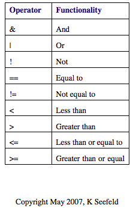

R and Rstudio: Introduction and Data Structures
================================================

R is a free programming language for statistical computing and graphics. It is an implementation of the S programming language and was created by Ross Ihaka and Robert Gentleman at the Univeristy of Auckland, New Zealand. R is currently developed by the R Development Core Team. Rstudio is an Integrated Development Environment (IDE) for R. 

To start, download the latest versions of R and Rstudio following the instructions provided `here <https://programming-workshops.readthedocs.io/en/latest/workshops/00_instructions/r.html>`_

===============================
Getting Started
===============================

Open Rstudio locally and learn how to use the `Rstudio interface <https://www.youtube.com/watch?v=jAgbZ8jkBtQ>`_.

=====================
Basic Operations in R
=====================

We can use R as a calculator to do simple math operations such as addition (+), subtraction (-), multiplication (*), division (\), and raise a value to a power (^). We can type these calculations in the console or run them in an R script that extension ends in .R  

.. code:: R
   
   #We can use hashtags to make comments about our code
   #Basic calculations in R
   4 + 5
   4 - 5
   4 * 5
   4/5

.. code:: R
   
   #Outputs of calculations
   [1] 9
   [1] -1
   [1] 20
   [1] 0.8

.. code:: R

   #Calculate exponents using ^
   4^5
   
.. code:: R
   
   #Output of exponent
   [1] 1024

***************
Data Structures
***************

R has many data structures and types that we can use, depending on the information we want to work with. 

The major data types include:

- character

- numeric (real or decimal)

- integer

- logical

- double

- complex

The major data structures include:

- Scalars

- Atomic Vectors

- Factors

- Lists

- Matrices and Arrays

- Dataframes

*******
Scalars
*******

The simplest type of object is a scalar which is an object with one value. We can assign a value or calculations to a variable using the assignment operator "<-". 

Note: The equals sign "=" is not an assignment operator in R and has a different functionality which will be discussed further below.

To create scalar data objects x and y:

.. code:: R
   
   #Set x and y as values 
   x <- 4    
   y <- 5 

The objects x and y were set a numeric data type.

We can manipulate these objects in R and perform different calculations together. To print the value of these variables, we can use the print() function or call the variable itself.

.. code:: R
   
   #Calculations with numeric variables

   z <- x+y   
   
   z

   print(z)

   x*y/z

.. code:: R
   
   #Output of calculations
   
   [1] 9

   [1] 9

   [1] 29    

As stated above, we can also create data objects of other data types such as logical and character mode.

For logical data, we use TRUE (T) and FALSE (F)

.. code:: R
   
   Logical <- T
   
   Logical

   [1] TRUE

For characte data, we use single or double quotation to enclose the data

.. code:: R
   
   Character_Data <- "T"
   
   Character_Data

   [1] "T"

We can use available functions in R to different the mode or type of data we are working with.

.. code:: R
   
   #Use mode function
   mode(x)
   [1] "numeric"

   mode(Logical)
   [1] "logical"

   mode(Character_Data)
   [1] "character"

.. code:: R
   
   #Use is.object() function
   is.numeric(x)
   [1] TRUE

   is.logical(Logical)
   [1] TRUE

   is.numeric(Character_Data)
   [1] FALSE

*******
Vectors
*******

A vector is a basic data structure in R. It is a set of scalars of the same data type.

We can create vectors in different ways.

One of the main ways is to use the function c() to concatenate multiple scalars together.

.. code:: R

   x <- c(1, 5, 4, 9, 0)

   x

   [1] 1  5  4  9  0

We can use function typeof() to determine the data type of a vector, and we can check the length of the vector using the funtion length() .

.. code:: R

   typeof(x)

   [1] "double"

   length(x)

   [1] 5

If we set x to have elements of different data types, the elements will be coerced to the same type. 

.. code:: R

   x <- c(1, 5, FALSE, 9, "help")
   
   x 

   [1] "1"  "5"  "FALSE"  "9"  "help"

   typeof(x)

   [1] "character"

Instead of reassigning the elements of x using the function c(), we could reassign specific elements based on the index number.

.. code:: R

   #Reassign third and fifth elements back to original values 
   x 

   [1] "1"  "5"  "FALSE"  "9"  "help"

   x[3] <- 4

   x[5] <- 0

   x

   [1] 1  5  4  9  0

   typeof(x)

   [1] "double"

Other ways to creat vectors is to use other operators and functions such as ":" operator, seq() function, and rep() function. 

.. code:: R

   #Create vector of consecutive numbers

   y <- 1:10

   y

   [1] 1  2  3  4  5  6  7  8  9  10

   #Create vector of a sequence of numbers
   #Defining number of points in an interval or step size

   seq(1, 10, by = 1)

   [1]  1  2  3  4  5  6  7  8  9 10

   seq(1, 10, length.out = 10)

   [1]  1  2  3  4  5  6  7  8  9 10

   #Create vector of the same values

   rep(3, 5)  # A set of 5 numbers with value set as 3

   [1] 3 3 3 3 3

*******
Factors
*******

A factor is a special type of character vector. Factors are qualitative or categorical variables that are often used in statistical modeling. To create a factor data structure, we will first create a character vector and convert it to a factor using the factor() function.

.. code:: R
   
   temperature <- c("High","Medium","Low")
   temperature <- factor(temperature)

Converting temperature character vector to a factor type creates “levels” based on the factor values (these are the values of categorical variables).

.. code:: R
   temperature

   [1] High Medium Low
   Levels: High Low Medium

*******************
Matrices and Arrays
*******************

So far we have discussed one-dimensional objects. We can create objects of multidimensional data. Matrices are data structures that contain data values in two dimensions. An array is a matrix with more than two dimensions. Matrices and arrays are used perform efficient calculations in a computationally fast and efficient manner.

To create a matrix, we can use the matrix() function, which takes as arguments a
data vector and parameters for the number of rows and columns.

We can determine the dimensions of a matrix using the dim() function.

.. code:: R
   #Create a simple 2 by 2 matrix.

   mat<-matrix(c(2,6,3,8),nrow=2,ncol=2)
   
   mat

       [,1] [,2]
   [1,] 2    3
   [2,] 6    8 

   dim(mat)

   [1] 2 2

We can also choose to add row names and column names to the matrix.

.. code:: R
   #Add row names and column names

   rownames(mat) <- c("a", "b")

   colnames(mat) <- c("c", "d")

     c d
   a 2 3
   b 6 8

   #Add row names and column through the matrix function

   mat<-matrix(c(2,6,3,8),nrow=2,ncol=2,
               dimnames = list(
                   c(a,b),
                   c(c,d)        
               )
               )
   
   mat

     c d
   a 2 3
   b 6 8

We can also create a matrix by concatenating vectors together using rbind() function to concatenate by rows or cbind() function to concatenate by columns.

.. code:: R
    
    x <- 1:3

    y <- 4:6

    # Combine by rows
    a <- rbind(x,y)

    a

       [,1] [,2] [,3]
    x    1    2    3
    y    4    5    6

    # Combined by columns
    b <- cbind(x,y)

    b

        x y
   [1,] 1 4
   [2,] 2 5
   [3,] 3 6

To create an array, we can use the function array(), which takes as arguments vectors as input and uses the values in the dim parameter to create an array. 

.. code:: R

   vector1 <- c(1,2,3)
   vector2 <- c(5,6,7,8,9,10)

   # Create an array with dimension (3,3,2) that creates 2 arrays each with 3 rows and 3 columns. 

   array1 <- array(c(vector1,vector2),dim = c(3,3,2))
   
   array1
   

   , , 1

        [,1] [,2] [,3]
   [1,]    1    5    8
   [2,]    2    6    9
   [3,]    3    7   10

   , , 2

        [,1] [,2] [,3]
   [1,]    1    5    8
   [2,]    2    6    9
   [3,]    3    7   10

*****
Lists
*****

Lists are data objects which contain elements of different types including numbers, strings, vectors, and other lists. A list can also contain a matrix or even a function as its elements. 

.. code:: R
   
   #Create a list of different data types

   list_data <- list(c(2,4,6,8), "Hello", matrix(c(11,12,13,14),nrow=2,ncol=2),TRUE, 62.13, FALSE)
   print(list_data)
   
   # Give names to the elements in the list

   names(list_data) <- c("Vector1", "Character1", "Matrix1", "Logical1", "Numeric", "Logical2")

   $Vector1
   [1] 2 4 6 8

   $Character1
   [1] "Hello"

   $Matrix1
        [,1] [,2]
   [1,]   11   13
   [2,]   12   14

   $Logical1
   [1] TRUE

   $Numeric
   [1] 62.13

   $Logical2
   [1] FALSE

We can use the function str() to list the underlying structure of the data object.

.. code:: R
  str(list_data)

.. code:: R
     List of 6
   $ Vector1   : num [1:4] 2 4 6 8
   $ Character1: chr "Hello"
   $ Matrix1   : num [1:2, 1:2] 11 12 13 14
   $ Logical1  : logi TRUE
   $ Numeric   : num 62.1
   $ Logical2  : logi FALSE

***********
Data Frames
***********

A data frame is a table in which each column contains values of one variable or vector and each row contains one set of values from each column. Within each column, all data elements must be of the same data type. However, different columns can be of different data types. The data stored in a data frame can be of numeric, factor or character type. In addition, each column should contain same number of data elements.

To create a data frame, we can use the function data.frame():

.. code:: R
  #Create a data frame with employee ID, salaries, and start dates
  
  emp.data <- data.frame( 
   emp_id = c("U974","U503","U298","U545","U612"),
   salary = c(623.3,515.2,611.0,729.0,843.25), 
   start_date = as.Date(c("2012-01-01", "2013-09-23", "2014-11-15", "2014-05-11",
      "2015-03-27")),
   stringsAsFactors = FALSE
  )

  emp.data

.. code:: R
      emp_id salary start_date
  1     U974 623.30 2012-01-01
  2     U503 515.20 2013-09-23
  3     U298 611.00 2014-11-15
  4     U545 729.00 2014-05-11
  5     U612 843.25 2015-03-27

We can use the function str() to list the underlying structure of the data object.
.. code:: R
  str(emp.data)

.. code:: R
    'data.frame': 5 obs. of  3 variables:
   $ emp_name  : chr  "U974" "U503" "U298" "U545" ...
   $ salary    : num  623 515 611 729 843
   $ start_date: Date, format: "2012-01-01" "2013-09-23" ...

We can extract data from the data frame and also add data to the data frame.

.. code:: R
  #Extract salary information
  emp.data$salary

.. code:: R
  [1] 623.30 515.20 611.00 729.00 843.25

.. code:: R
  #Add column vector
  emp.data$dept <- c("IT","Operations","IT","HR","Finance")

.. code:: R
      emp_id salary start_date       dept
  1     U974 623.30 2012-01-01         IT
  2     U503 515.20 2013-09-23 Operations
  3     U298 611.00 2014-11-15         IT
  4     U545 729.00 2014-05-11         HR
  5     U612 843.25 2015-03-27    Finance

******************************************
More Examples of Data Structures and Types
******************************************

To learn more about data types and structures and see more examples, watch these available videos below.
`Part 1 <https://www.youtube.com/watch?v=B2f9tSGVn7w>`_
`Part 2 <https://www.youtube.com/watch?v=_HKDbA9WkX8>`_

==================================
Conditional Statements and Looping
==================================

*********************************
Logical and relational operators
*********************************

Logical and relational operators can be used to execute code based on certain conditions. Common operators include:

*********************************
If statements
*********************************

.. code:: R
  q<-3
  t<-5
  #if else conditional statement 
  if(q<t){

    w<-q+t
  
    } else 
      
      w<-q-t

.. code:: R
  w
  
  [1] 8 

.. code:: R
  a<-2
  b<-3
  c<-4
  #Using and to test two conditions, both true

  if(a<b & b<c) x<-a+b+c

.. code:: R
  x
  [1] 9 

*********************************
Looping
*********************************

We can use looping to efficiently repeat code without
having to write the same code over and over.

The while loop repeats a condition while the expression in parenthesis holds true and takes the form:

.. code:: R
  while (condition controlling flow is true)
        perform task 

.. code:: R
  x<-0
  while(x<=5){x<-x+1}
  

.. code:: R
  x
  [1] 6 

For loops are used to iterate through a process a specified number of times. A
counter variable such as "i" is used to count the number of times the loop is executed: 

.. code:: R
  for (i in start:finish)
      execute task 

An example is to add values 1 to 10 to vector y using a for loop.

.. code:: R
  #Create empty vector
  y<-vector(mode="numeric")

  #Loop through 1 to 10 to add values to y
  for(i in 1:10){
     y[i]<-i
     }
 
.. code:: R
  y
  [1] 1 2 3 4 5 6 7 8 9 10 

To learn more about if statements and logical operators, check out this `video <https://www.youtube.com/watch?v=eVEx_pBEkRI>`

Alternatives to using looping and conditional statements include using the apply function in R. A quick introduction to apply function is provided `here <https://www.youtube.com/watch?v=csLati8vpOo>`_.

