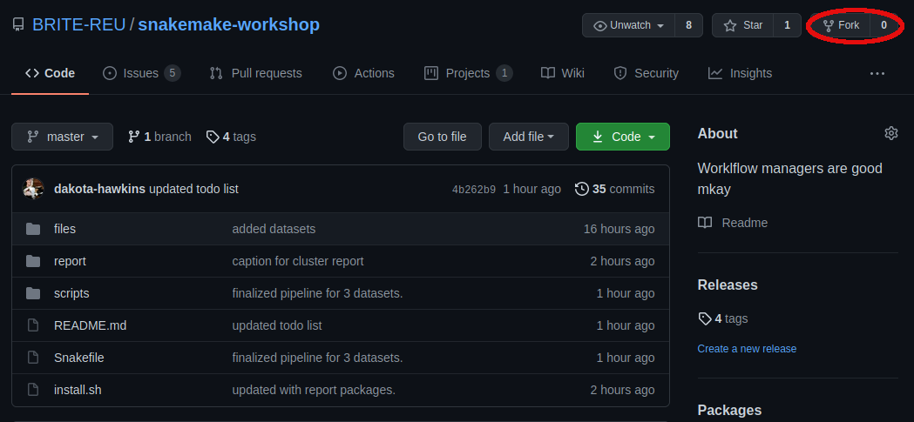
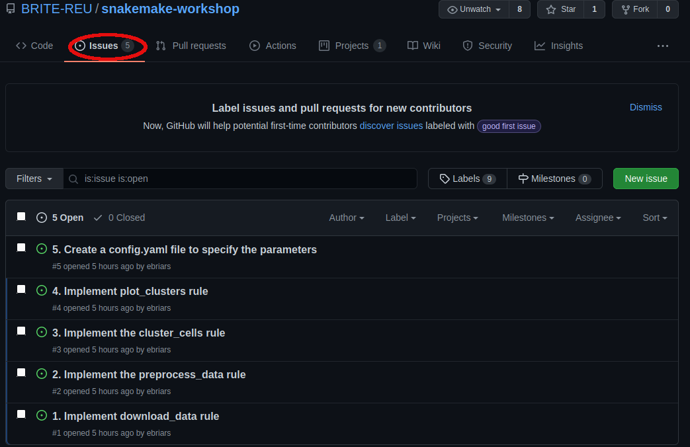
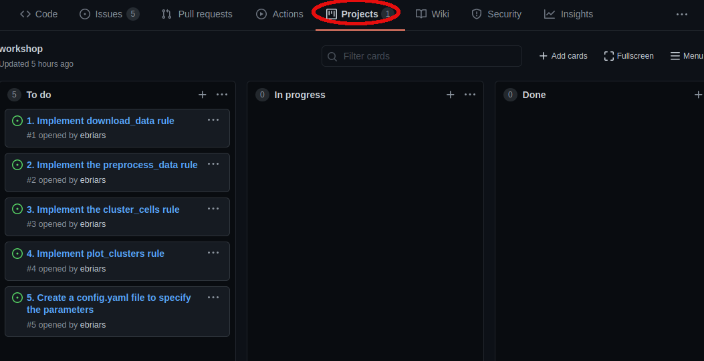

Workshop 4. Reproducible Research with Snakemake and Git
--------------------------------------------------------

Instructors: Dakota Hawkins and Emma Briars

.. contents::
   :local:

In this workshop you will use Snakemake to implement a basic pipeline to download,
preprocess, and cluster single-cell RNA sequencing (scRNA-seq) datasets. During
development, you will use git and GitHub for version control to track changes
and complete to-dos. You can either complete the tasks on the Shared Computing
Cluster (SCC) or on your local computer. We will be using the ``git`` command
line interface throughout this workshop.

.. tip::

    To login to the SCC use: ``ssh <username>@scc1.bu.edu``

.. tip::

    Once on the scc, start an interactive session using: ``qrsh -pe omp 2 -l mem_per_core=4``

Getting started
+++++++++++++++

A basic skeleton pipeline is hosted on the BRITE github `here. <https://github.com/BRITE-REU/snakemake-workshop>`_
To begin, login to GitHub using your personal log-in, navigate to the skeleton repository,
and fork the repo.

Forking the repo will give you access to your own independent version of the
repository. 

Once you've forked the repo to your own Github profile, clone the repo to either
your local computer or the scc using ``git clone``. This workshop will require 
several packages necessary for analysis. To install these packages we have
provided an ``install.sh`` bash script. However, because of ``conda`` weirdness,
you'll need to execute the script line-by-line.

Introduction
++++++++++++

While the packages are installing, navigate to the **issues** tab in your forked
version of the repository.

Here you will see a list of "issues" that need to be resolved. We will implement
the analysis pipeline by resolving each issue in order. Which issues need to be
worked on, and which issues have already been completed, can be visualized using
project boards.

To actually implement the fixes necessary to produce a working pipeline, we will
be modifying the workflow file, ``Snakefile``, to specify target input, parameters,
and output. We will also need to make small modifications to the called scripts
to ensure they are correctly handling the arguments passed by ``snakemake``.

Once you've completed a task, you should ``add``, ``commit`` and ``push`` the
modified files to your remote repository on GitHub. When commiting, specify
issue the commit is resolving in order to automatically close the respective
issue. For example, assuming I have modified ``Snakefile`` and
``scripts/download_data.py`` to correctly download the ``pbmc3k`` dataset, I
would write:

.. code-block:: bash

    git commit -m 'Now downloads pbmc3k dataset. Fixes #1' 

By including ``Fixes`` followed by the issue number (i.e. ``#1``) GitHub
recognizes that the changes fixes the outstanding issue and closes it. Once
pushed, go look at the issues and project board on your repository to see what's
changed. Repeat this process for all listed issues and by the end you'll have a
functional pipeline!