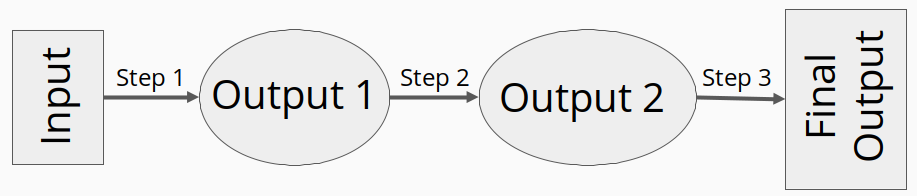
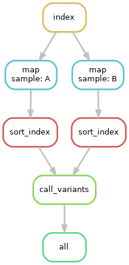
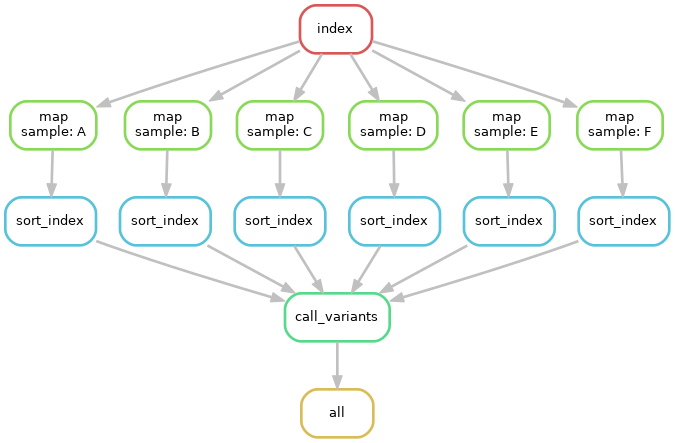

Snakemake and Workflow Management
=================================

.. contents::
    :local:

Installation and Running
++++++++++++++++++++++++
To install Snakemake, you will first need to have ``conda`` installed. Conda is
a package manager that comes with Anaconda, which you should have installed for
the Python workshop. To install Snakemake, simply execute the following command 
in a terminal with ``conda`` available:

.. code-block:: bash

    conda install snakemake

For more thorough instructions, you can take a look at the Snakemake `documentation <https://snakemake.readthedocs.io/en/stable/getting_started/installation.html>`_

Assuming Snakemake is installed, it can be run by issuing the ``snakemake`` command in 
a terminal where the working directory contains a file called ``Snakefile``, which
details the workflow for Snakemake to execute. 

Analysis as a Directed Acyclic Graph
++++++++++++++++++++++++++++++++++++

Traditional bioinformatics analyses often involves many steps across many
different files. Files are often large, analysis can be time consuming, and
multiple tools will likely be used in order to get from the raw data to final
interpretable results. The entire process, starting from raw data and the
subsequent analysis steps performed to generate the final produce, is called a
workflow or a pipeline. It is often helpful to break a workflow into single steps, where the 
output from one step is used an input to another. In this way, we can model a
workflow as a directed acyclic graph (DAG).

By modeling a workflow as a DAG, identifying dependencies and necessary orders of
executions is relatively simple. This is is where workflow managers, such as Snakemake, come in. At
a high level, workflow managers have been developed to execute the workflow DAG
in order. Theoretically, it would be possible to oversee such execution yourself,
or perhaps you could even get a little fancy and write a ``bash`` script to run 
each step. However, workflow managers provide several benefits:

1. Perform the same task across many files without writing extra code.
2. Track sucessful execution of each task to easily allow start-up from failure.
3. Centralize description of analysis workflow to single file.
4. Produce integrated `reports <https://koesterlab.github.io/resources/report.html>`_ for each step.
5. Re-run entire pipelines for new data or new parameters with minimal changes.
6. Many other niceties such as cluster integration,  

While there are many workflow/pipeline management tools around, such as 
`Nextflow <https://www.nextflow.io/>`_, `Luigi <https://github.com/spotify/luigi>`_,
and many others, we will be using `Snakemake <https://snakemake.readthedocs.io/en/stable/>`_.

Snakemake
+++++++++

Introduction
------------

Snakemake is a python-based workflow/pipeline management tool. It's based on
`GNU Make <https://www.gnu.org/software/make/>`_ and follows a file-based production
rule implementation. That is, a *rule* is an operation that takes an input one file,
and operates onto it to produce another file.

..code-block::
    rule copy_file:
        input:
            "test.txt"
        output:
            "test_copy.txt"
        shell:
            "cp {input} {output}"

In the above example, we created a rule called `copy_file` that copies one file
to another location. The *input* file(s) is specified by the ``input`` block, the 
expected *output* file(s) to produce is denoted by the ``output`` block, and the
operations to generate the output file are implemented by the ``shell`` block.
Input and output file names are passed to the shell command using curly brackets ``{}``,
as shown above.

A More Thorough Example
-----------------------

To go over the general structure of rules and how to string them together, we
will look at an example pipeline from the Snakemake `documentation. <https://snakemake.readthedocs.io/en/stable/tutorial/short.html>`_
This example workflow will go through some example steps to perform `variant calling <https://www.ebi.ac.uk/training/online/courses/human-genetic-variation-introduction/variant-identification-and-analysis/>`_

You are encouraged to read over the general structure and syntax of snakemake here,
**before** following the linked tutorial for a more interactive introduction.

The raw data, target output, and required analysis steps for this pipeline can
be broken down as:

- Starting Data
  - Short read sequences in fastq format
  -  Publicly available genome fasta file
- Target Output
  - VCF file of found variants
- Required Steps 
  - Map reads to genome
  - Sort and index mapped reads
  - Call variants

To begin, we create a **rule** to generate a genomic index (required for alignment).

..code-block::

    rule index:
        input:
            "data/genome.fa"
        output:
            "data/genom_index"
        shell:
            "bwa index -p genome_index {input}"

Here we have created the rule *index* that takes the input file ``data/genome.fa``
(assumed to exist) and creates the ``data/genome_index`` file by calling ``bwa index``
(``bwa`` is an alignment `tool <http://bio-bwa.sourceforge.net/>`_).

Once the index has been created, we can now map our ``fastq`` files to the genome,
also using ``bwa``. Such a rule would look like this:

.. code-block:: python

    rule bwa_map:
        input:
            index="data/genome_index"
            fq="data/samples/A.fastq"
        output:
            "mapped_reads/A.bam"
        shell:
            "bwa mem {input.index} {input.fq} | samtools view -Sb -> {output}"

The above rule introduces the possibility of working with multiple input/output
files. These files can be specified using key words (i.e. "index" and "fq"). Individual
files can then be accessed individually using ``.`` accessors as shown above.
Because the above file uses "data/genome_index" as input, and because our previous
rule ``index`` generates the "data/genome_index" file, Snakemake will know ``index``
must be executed *before* ``bwa_map``.

While the ``bwa_map`` map successfully aligns reads to generate alignments,
however, as written we would need to write a separate ``bwa_map`` rule for each
fastq file we have. To get around this, we use **wildcards** wildcards are automatically
detected by snakemake using existing file names. For this example, assume we have two 
fastq files "data/samples/A.fastq" and "data/samples/B.fastq". To modify ``bwa_map``
recognize it should align both fastq files, we again use curly brackets ``{}`` to mark
wildcard regions in filenames:

.. code-block:: python

    rule bwa_map:
        input:
            index="data/genome_index"
            fq="data/samples/{sample}.fastq"
        output:
            "mapped_reads/{sample}.bam"
        shell:
            "bwa mem {input.index} {input.fq} | samtools view -Sb -> {output}"

As written, snakemake will automatically detect that ``bwa_map`` should be run for
both fastq files.

Before calling variants, we must first sort the our newly created alignment files.
To do so, we create the rule ``samtools_sort``.

.. code-block:: python

    rule samtools_sort:
        input:
            "mapped_reads/{sample}.bam"
        output:
            bam="sorted_reads/{sample}.bam"
            bai="sorted_reads/{sample}.bam.bai"
        shell:
            "samtools sort -T sorted_reads/{wildcards.sample} "
            "-O bam {input.bam} > {output};"
            "samtools index {output}"

Because the above rule makes use the ``sample`` wildcard, snakemake will again 
know it will need to execute the rule for each ``.bam`` file produced by ``bwa_map``. 
As shown in the ``shell`` block, you are able to explicity reference wildcards for each 
run as shown by ``{wildcards.sample}``. Now that we have sorted alignments, we 
can peform the final step of the pipeline and call variants using ``bcftools``.

.. code-block:: python

    SAMPLES = ["A", "B"]
    rule bcftools_call:
        input:
            fa="data/genome.fa",
            bam=expand("sorted_reads/{sample}.bam",
                    sample=SAMPLES),
            bai=expand("sorted_reads/{sample}.bam.bai},
                    sample=SAMPLES)
        output:
            "calls/all.vcf"
        shell:
            "samtools mpileup -g -f {input.fa} {input.bam} "
            "| bcftools call -mv -> {output}"

Above, the rule ``bcftools_call`` uses the ``expand`` function from snakemake to
to aggregate inputs accross wildcards. In this specific case ``bam`` and ``bai``
input "files" are actually two separate lists of files containing generated ``bam``
and ``bam.bai`` files for both "A" and "B" samples. An important note, is that
``expand`` functions in Snakemake are often **required** in order to for Snakemake
to recognize allowable wildcard values.

Finally, we we can put the entire pipeline together in a single ``Snakefile``,
while also specifying an ``all`` rule which tells Snakemake which file should be
the default target.

.. code-block:: python

    SAMPLES = ["A", "B"]
    rule all:
        "calls/all.vcf"

    rule index:
        input:
            "data/genome.fa"
        output:
            "data/genom_index"
        shell:
            "bwa index -p genome_index {input}"

    rule bwa_map:
        input:
            index="data/genome_index"
            fq="data/samples/{sample}.fastq"
        output:
            "mapped_reads/{sample}.bam"
        shell:
            "bwa mem {input.index} {input.fq} | samtools view -Sb -> {output}"

    rule samtools_sort:
        input:
            "mapped_reads/{sample}.bam"
        output:
            bam="sorted_reads/{sample}.bam"
            bai="sorted_reads/{sample}.bam.bai"
        shell:
            "samtools sort -T sorted_reads/{wildcards.sample} "
            "-O bam {input.bam} > {output};"
            "samtools index {output}"

    rule bcftools_call:
        input:
            fa="data/genome.fa",
            bam=expand("sorted_reads/{sample}.bam",
                    sample=SAMPLES),
            bai=expand("sorted_reads/{sample}.bam.bai},
                    sample=SAMPLES)
        output:
            "calls/all.vcf"
        shell:
            "samtools mpileup -g -f {input.fa} {input.bam} "
            "| bcftools call -mv -> {output}"

Using network diagrams, we can visualze the above workflow as a simple DAG:

The above image shows not only the dependence of rules on other rules, but also 
the execution order of each step. Without changing the pipeline as written, but
instead expanding the ``samples`` wildcard to include *more* samples, we can easily
run the pipeline for an arbitrary number of samples.

Using Python and R with Snakemake
---------------------------------
In the above example, through the ``shell`` block, we only used rules that could execute their necessary
commands via bash. A ``shell`` block is nice if you are working with command-line tools,
however, we will often want to perform analysis either in ``R`` or ``Python``
scripts. Snakemake is able to handle passing input and parameters to both ``R``
and ``Python`` scripts using a ``script`` block. Assuming a ``Python`` script
``copy.py`` that copies one file to another, our basic copy rule could be replaced
with:

.. code-block::

    input:
        txt="test.txt"
    output:
        txt="test_copy.txt"
    script:
        "copy.py"

where ``copy.py`` might be implemented as:

.. code-block:: python

    import shutil
    if __name__ == '__main__':
        try:
            snakemake
        except NameError:
            snakemake = None
        if snakemake is not None:
            shutil.copy(snakemake.input['txt'], snakemake.output['txt'])

Meanwhile, Snakemake parameters passed to an ``R`` script using the ``@`` operator
(e.g. ``snakemake@input[['txt]]`` and ``snakemake@output[['txt']]``)

Rule Parameters, Configuration Files, Input Functions, Oh My!
-------------------------------------------------------------
Often we will want to pass parameters to each rule, set configuration files for
each run of data, and might require some more sophisticated specifications for
our input files. Now that you've been introduced to the basic motivation, syntax,
and structure behind Snakemake, you should follow along interactively with the
tutorial as described on the Snakemake `website <https://snakemake.readthedocs.io/en/stable/tutorial/setup.html>`_.
Because we will need to run our own pipeline during the workshop, it is suggested
to implement + run the pipeline on either your local computer, or on the scc --
whichever you'll be using during the actual workshop. By the end of the tutorial,
you should know the basics for writing and running Snakemake pipelines. If you
complete up until te "Additional Features" step, you should have enough knowledge
to complete the upcoming workshop.

