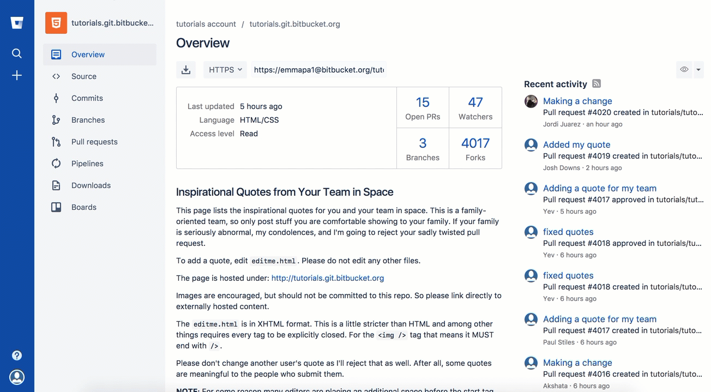

Solutions
---------

Forking a repository
++++++++++++++++++++

On `Bitbucket <https://confluence.atlassian.com/bitbucket/forking-a-repository-221449527.html>`_ you can fork from the left menu:

On `GitHub <https://help.github.com/articles/fork-a-repo/>`_ on the top left you can find the fork button.

.. image:: fork_github.png
   :target: https://guides.github.com/activities/forking/

Editing from the server
+++++++++++++++++++++++

Go to the Bitbucket website, and find your repository.
Go to **Source**, and open the Readme file.
Click **Edit** to make changes to the Readme, and write your name.
Click the **Commit** button to save your changes.

