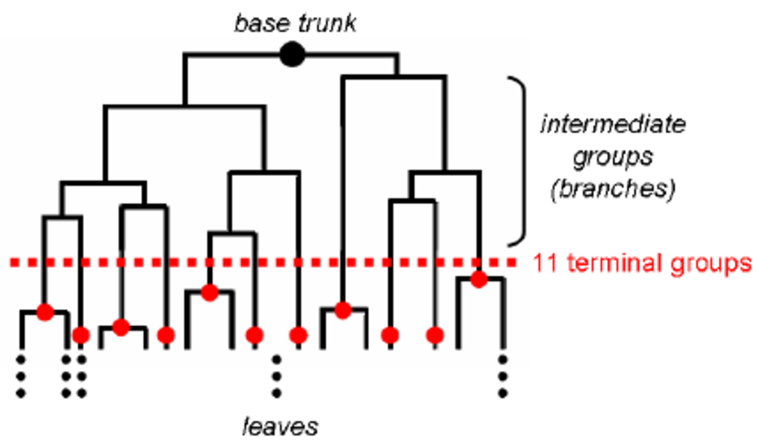

.. _linux_bash:

============================================
Workshop 5: Learning
============================================
After preparing the data we can learn it. 
There are 2 main learning methods: supervised, when we have *labels* and we want to learn a model using those to predict future samples (classification) or when we don't know the *label* and we simply want to find pattern and classes (clustering).

--------------------------------------------
 Unsupervised learning
--------------------------------------------

"Unsupervised learning is a type of machine learning algorithm used to draw inferences from datasets consisting of input data without labeled responses. The most common unsupervised learning method is cluster analysis, which is used for exploratory data analysis to find hidden patterns or grouping in data." `read more... <https://www.mathworks.com/discovery/unsupervised-learning.html>`_

***************************
Dimensionality reduction
***************************
It is hard to interpret the data in the feature space (M dimensions). The first exploration step into data is to reduce the dimensionality to 2 dimensions and plot the dimensions in x-y coordinates which are human readable. 

* **Principle Component Analysis (PCA)** is the most commonly used dimensionality reduction method. Each principle component is a linear combination of Weights.Features, adjusting the weights to capture the most variability across the samples. The components are uncorrelated and can be plotted to observe the data in the 2 dimension space. You should keep in mind that while PCA shows the variability in the data, it is not always meaningful and might be showing noise or batch errors. 

* **Singular-value decomposition (SVD)** calculates the diagonal matrix S on the data matrix A :

.. math::
    A_{M \times N} = U_{M \times M} S_{M \times N} V_{N \times N}

where M is the feature size (columns) and N is the sample size (rows). Read more `here <http://andrew.gibiansky.com/blog/mathematics/cool-linear-algebra-singular-value-decomposition/>`_. 

***************
Clustering
***************
To explore the data we can do some sort of clustering. 
Clustering algorithms try to divide the data samples based on some sort of similarity into different *clusters*. An example is to cluster single cell gene expression data to find tissue types.

* **Hierarchical clustering** is the most basic clustering algorithm. The samples are put in it's own 'clade' and then iteratively the most similar clades are combined. This can be done bottom up or downwards to form a dendrogram which you can cut at any level to obtain different number of clusters. Hierarchical clustering is usually shown as a heatmap.

.. raw:: html

    <iframe width="560" height="315" src="https://www.youtube.com/embed/7xHsRkOdVwo" frameborder="0" allow="autoplay; encrypted-media" allowfullscreen></iframe>

 
* **K-means** is a method to cluster the samples into K groups with different means. The algorithm starts by choosing K random points as *means* in the feature space and assigning samples to each cluster based on their closest mean (by some similarity measure). The means are iteratively moved to best fit the samples until no further improvement can be done. This method is not deterministic and depends on the initial random guesses.

.. image:: img/k-means.png

.. raw:: html

    <iframe width="560" height="315" src="https://www.youtube.com/embed/BVFG7fd1H30" frameborder="0" allow="autoplay; encrypted-media" allowfullscreen></iframe>
    

* **X-means** is a general K-means clustering algorithm that tries different K values to find the K that best represents the data.

The following image shows different clustering algorithm run on different data (2 dimensions).

.. image:: img/clustering.png
    :target: https://towardsdatascience.com/the-5-clustering-algorithms-data-scientists-need-to-know-a36d136ef68

Note that in all these clustering methods we talked about similarity. Similarity can be defined differently. **Euclidean distance** is the most common measure by simply measuring the straight line distance between the two samples in the feature space.
For a detailed comparison read this article:

`Shirkhorshidi, Ali Seyed, Saeed Aghabozorgi, and Teh Ying Wah. "A comparison study on similarity and dissimilarity measures in clustering continuous data." PloS one 10.12 (2015): e0144059. <http://journals.plos.org/plosone/article?id=10.1371/journal.pone.0144059>`_

It is very important to keep in mind that *any data clusters*. Clusters obtained by any method are a way to explore the data. You can measure the *fitness* of the clustering by measuring the intra-clusters similarity vs. the in-between cluster dissimilarity. 
Commonly used measure are Silhouette coefficient and the Davies–Bouldin index.

--------------------------------------------
 Supervised
--------------------------------------------
Another common learning approach is to learn a predictive model on labeled data to use later to predict new unknown samples. This is referred to as **classification**. 
Classification is applied to the a subset of the data - *train*, and tested on a smaller subset - *test*. So the first step is to split the data into two sets (usually 75% train and 25% test). The purpose of separating some data as test is to later verify the model and ensure we are not over-fitting. The most critical part in classification is to ensure the train data does not *leak* into the test, meaning no information from the train should be secreted to the test - whether at feature selection step or when learning the model.

##########################
Fitness (perofrmance) the model
##########################
A classification model is measured by its **fit**: how well does is fit the data. In other words the average error of the predicted labels vs. the actual labels. We could obtain very high fitness by increasing the features. This situation is referred to as over-fitting. This means instead of learning general patterns in the data we are learning noise, such that although we do respectively good on the train dataset, our model will fail to perform well on new data (test set) due to lack of generalization. 
On the contrary, underfitting is when our model is over-generalizing, and thus cannot perform well. Under-fitting is easier to detect because the model has low fitness (low accuracy or precision), while over-fitting can be tempting as you see bloated fitness.

**Confusion matrix** is a table showing out of total samples of each label class how many were predicted of each class:

.. image:: img/confusion_matrix.png

If you show the performance of the model as a confusion matrix, fitness can be measured by 4 criteria:

* **Accuracy** 

* **Precision**

* **Recall** 

* **Area Under Curve (AUC)**

--------------------------------------------
 semi-supervised
--------------------------------------------

--------------------------------------------
 semi-supervised
--------------------------------------------
Tools:

**R and python**

**RapidMiner**

**Other tools**
KNIME
Weka
