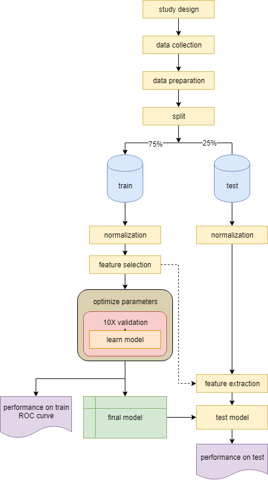
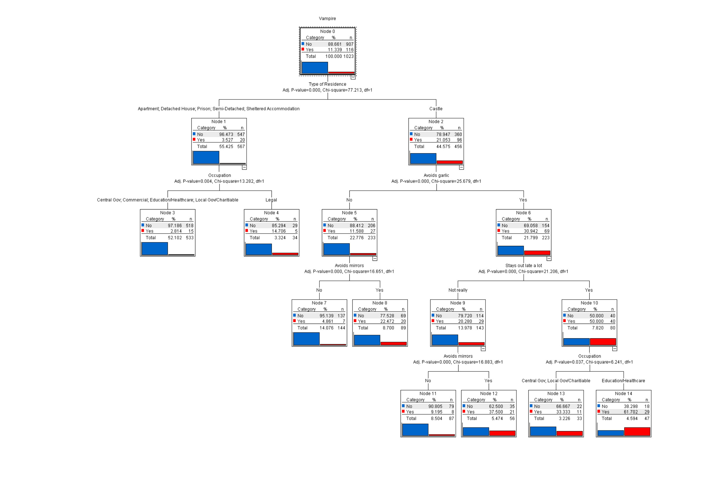

.. _linux_bash:

============================================
 Supervised learning
============================================

Another common learning approach is to learn a predictive model on labeled data to make predictions on new unknown samples. This is referred to as **classification**. 
Classification is applied to a subset of the data - *train*, and tested on a smaller subset - *test*. So the first step after data preparation is to *randomly* split the data into two sets (usually 75% train and 25% test). Check if your train and test are not biased (by age, sex, or label). The purpose of separating some data as test is to later verify the model and ensure we are not over-fitting. The most critical part in classification is to make sure the train data does not *leak* into the test, meaning no information from the train should be secreted into the test data - whether at normalization, feature selection, or when learning the model.

---------------------------------
Classification models
---------------------------------

*******************
Probability based
*******************
These models use probability to predict the label.

* **Naive-bayes** uses Bayes theorem on the feature distribution and probabilities. Usually is used as a baseline model (default or worse). Applies to nominal labels.  
* **K nearest neighbors (KNN)** predicts each sample based on majority vote of its K nearest neighbors (the K most similar samples). It works good in tumor/tissue samples. The kernel determines what similarity measure we are applying. Applies to nominal labels.

**************
Regression
**************
This group of classifiers to separate numeric features using regression. The separation can be single line (a weighted sum of the features to estimate the label) or a plane in a M-dimensional space. (M is the number of features)

* **Linear regression** is a simple model used to find effect size of features. It's the first model you would run to check if there is some significant correlation between your features and label; gives you weights (intercepts) and applies to numeric labels.
* **Logistic regression** is similar to linear regression but applies to nominal labels.
* **Support Vector Machine (SVM)** is one of the strongest and most popular learning models. It produces vectors to separate the samples. adjusting the kernel can make it very powerful. Applies to binominal labels. The prediction output is probabilistic: [0, 1] for each class. 

**************
Trees
**************
At each iteration a tree randomly samples the train data (sampling) and chooses a random set of features (bagging). The it find one feature that on a threshold divides the sampling data such that the labels are best separated. At each node a decision is to be made and following the branches we can get to a leaf node which is marked with the most probable label. The label should be nominal for trees.

Bellow is a decision tree to predict if a sample is a vampire. Each branch ask a question and based on that divides the samples. Following the branches you get to a leaf which is labeled by the label majority of the train samples ending there. 

Trees are very popular in gene expression since they give an understanding of which genes are most important (top nodes) and what is the splitting criteria (if expression > threshold it's a case or control) and thus the results can be tested in the lab. 

Parameters on trees matter a lot. Trees are random algorithms (random sampling). Unlike regression models, trees are not linear.

* **Decision tree** is a binary tree with each node being a decision on a feature.
* **Random forest** is a collection of decision trees, each tree capturing one aspect of the data. Good in case you have different tissue or groups of data within labels.
* **Decision Stump** is a 1 level decision tree. Gives you the best feature to separate the data.
* **Gradient boosted trees** uses boosting to improve weak decision trees. The leaf have a scoring value and the final label is predicted based on the sum of the leafs of each decision tree. This way if by random chance we found a weak tree, we can *boost* it using other trees.

**********************
Rule induction
**********************
Rule induction algorithms are similar to decision trees in the form that they find rules that split the data and made a hierarchy of rules. Unlike decision trees they use all the data and do not do sampling or bagging. 

**********************
Neural networks
**********************
Neural networks, inspired by the way human brains work, are commonly used in Natural Language Processing (NLP), speech recognition and Artificial Intelligence (AI). They are black box learning models, meaning we don't know how the model is working and we are only interested in the their prediction ability. Neural networks can literally learn anything. A 4 layer neural network can learn driving or recognize faces. A 2 layer can learn to find shadows and read handwriting. Despite the power of neural networks, they are not favored in bioinformatics due to their black box nature.

---------------------------------
Parameters
---------------------------------
It is very important that you completely understand how the model you are using works.
You must be able to justify choosing that model and be fully aware of the algorithm and the parameters it takes. 
R will allow you to run any model with default parameters. But setting the correct parameters is key to finding the best model. 
In order to find the *best* parameters, you can use optimization grids: try every possible value of each parameter with some resolution or faster evolutionary optimization algorithms that can find local optimum parameters.

*********************************
Kernels
*********************************
Every classification model uses a pattern analysis method to find patterns within label classes. This pattern analysis can be determined by different kernels. A kernel is a function f(features -> label). For example a linear kernel :math:`\sum{weights.X}`, vs. a higher degree :math:`\sum{weights.X^degree}`, radial basis function :math:`exp(- \frac{|X-X'|^2}{2\sigma ^2})`, ...
You should choose the kernel accordingly. Understand it. And in general, the more simple kernels are prefered (if linear works fine don't go to a ANOVA kernel). Complicated models put you at the risk of over-fitting. 
In general whatever choice you make in life, you should be able to justify it.

---------------------------------
Cross validation
---------------------------------

When learning the model on the train set, you should *always* use cross-validation. 
Cross validation is a method to divide the data (train) into X portions. In a 10X validation, the data will be divided into 10 portions, and each time 90% of the data will be used to learn the model and then the model will be tested on the remaining 10%. The final performance will be the average of all 10 models.

.. image:: img/cross_validation.jpg

Cross validation ensures that the data is not over-fitting. Also by calculating the the standard deviation of the performances, we can see how the model fits the data and the model is robust. In the following example you can see how cross validation will help you find the best fit. The top left model is over-fitted (while the average performance will be good the sd of the 10 models will be high). The bottom right model is under-fitting, where the average performance will be low. 

.. image:: img/CV_fit.gif

Note that cross validation is applied when learning a model on the train. It is a good approach to build a model but after this we still need to test the model on unseen test data. Why? Because the splits in the cross validation were correlated, so cross-validation is not a test performance, but rather a training performance.

---------------------------------
Fitness of the model
---------------------------------

A classification model is measured by its **fit**: how well does is fit the data, the predicted labels are close to the actual labels. We could obtain very high fitness by increasing the number of the features. This situation is referred to as over-fitting. This means instead of learning general patterns in the data we are learning noise, such that although we do respectively good on the train dataset, our model will fail to perform well on new data (test set) due to lack of generalization. 
On the contrary, underfitting is when our model is over-generalizing, and thus cannot perform well. Under-fitting is easier to detect because the model has low fitness (low accuracy or precision), while over-fitting can be tempting as you see bloated fitness.

**********************
Nominal labels
**********************

**Confusion matrix** is a table showing out of total samples of each label class how many were predicted of each class:

.. image:: img/confusion_matrix.png

.. code::

   TN=true negative (samples predicted to be in class negative and that was correct)
   TP=true positive (samples predicted to be in class positive and that was correct) 
   FN=true negative (samples predicted to be in class negative and that was incorrect)
   FP=true positive (samples predicted to be in class positive and that was incorrect) 

If you show the performance of the model as a confusion matrix, fitness can be measured by 4 criteria:

* **Accuracy**

.. math::

   \frac{TP + TN}{TP + FP + TN + FN}

* **Precision**

.. math::

   \frac{TP}{TP + FP}

* **Recall or specifity** 

.. math::

   \frac{TP}{TP + FN}

* **Area Under Curve (AUC):** I will not go into detail but AUC measures "the probability that a randomly chosen positive instance higher than a randomly chosen negative one (assuming *positive* ranks higher than *negative*)".

**********************
Numeric labels
**********************
In the case of numeric labels, we have to measure the *error* of the prediction. Here there is not binary true or false prediction but rather how close to the real value did we predict. The fitness measures for numeric values are:

* **mean squared error (MSE)**
.. math::

   MSE = \frac{1}{N} \sum{(label_{predicted} - label_{actual})^2}

* **Root mean squared deviation (RMSD)** 

.. math::

   RMSD = sqrt{\frac{\sum{(label_{predicted} - label_{actual})^2}}{N}}

**************************
Learning curves
**************************
*Receiver operating characteristic (ROC) curves* are an illustration of the performance of the model. The true positive rate (Sensitivity) is plotted as a function of the false positive rate for different cutoffs of a parameter. The area under the curve is the AUC measure mentioned above.

.. image:: img/roc_curve.png

**Learning curves** plot the performance of the model for different sample sizes. It is used to show out model is general and not overfitting. Note that in the following figure if the train and test error lines don't get tangent, that means we are over-fitting.

.. image:: img/learning_curve.png

--------------------------------------------
 Semi-supervised learning
--------------------------------------------
Semi-supervised learning is applied to data that is partially labeled. First using a clustering algorithm you find clusters, then you use the known labels and propagate them to the nearby samples.

--------------------------------------------
Summary notes
--------------------------------------------
1. Do not skip the data preparation step. Never trust the data you are working on. You must end up working for months trying to improve a dataset then notice there was some mislabeled samples. Or get very unexpected good results and then notice you had redundant samples.

2. Check for imbalances in your data. If 90% of your data is control and 10% case, a model that classifies everything as control will show 90% accuracy. If the nature of your data is imbalanced, make sure you specify balanced loss criteria while learning the model (positive and negative error will be treated respectively).

3. The main mistake in learning rises from train leakage to test. If the normalization method uses information from other samples (e.g. quantile normalization), it should be done separately on train and test. Feature selection/reduction should be done only on train, then the final features will be extracted from the test. No cheating.

4. When applying a model understand how the models work. Know it's parameters. Make rational choices and optimize parameters. 

5. Test multiple models and draw ROC curves to compare their performance.

6. Show more than 1 performance measurement. Do not rely on accuracy. Know what the expectation of your model is. The accuracy for a plane flight related model should be 99.99% but for human disease with so much variability, 80% can be a good prediction.

7. When possible use more simple models. If you model performs 90% with 100 features and 89% with 10 features, the later is a better model. Same goes for complexity, e.g. degree of a kernel. In general avoid using degree greater than 2.5.

8. Always draw learning curves to check for overfitting. However every model is overfitting to some extent.

9. After you tested your model on the test and proved your model is correct and generalized, combine all the data and make a final model with cross-validation. 

10. The power of a model is in its sample size and good feature selection. More samples better model. 

