Workshop 5: Data Visualization
==============================

In this online workshop you will learn the basic components neccessary
for appropriate and effective data visualization. In the in-class
workshop, you will put this information to test as you create unique
data visualization for relevant biological data.

Visualization Philosophy
------------------------

While science is often thought of as simply running experiments and
processing results, communicating those results is one of the most
important steps! Data visualization is a pivotal step that not only aids
in processing results, but also communicating key take aways. However,
not all visualizations are created equal, and poor visualizations may
obscure or even mislead important findings.

While not exhaustive, here are few guidelines to consider when making
visualizations:

Pick the Correct Plot to Represent Your Data
--------------------------------------------

It is important to pick the plot that best represents the data, and
supports conclusions.

Plotting Only Summary Statistics May Lead to Incorrect Conclusions
~~~~~~~~~~~~~~~~~~~~~~~~~~~~~~~~~~~~~~~~~~~~~~~~~~~~~~~~~~~~~~~~~~

There are many plots you can use to represent similar ideas. Boxplots,
violin plots, point plots, and beeswarm plots can all be used to
visualize the distribution of values within a feature. However, some
methods may better represent the actual distribution of your data, as
demonstrated below. The below image shows the potential danger of only
plotting summary statistics (boxplots simply plot the 1st, 2nd, and 3rd
quartile) while ignoring the raw data.

.. figure:: https://blog.bioturing.com/wp-content/uploads/2018/11/BoxViolin.gif

The above plot was taken from
`https://www.autodeskresearch.com/publications/samestats <here>`__, and
contains more interesting examples showing the potential downside of
plotting only summary statistics. Of course, some of these
visualizations are easier to interpret than others, and a simpler plot
may be better at communicating the main take away. It is important,
however, to ensure that such a plot does accurately show the underlying
patterns in your data.

Overplotting May Obscure Real Patterns
~~~~~~~~~~~~~~~~~~~~~~~~~~~~~~~~~~~~~~

In single-cell biology, it is common to plot each cell in a scatter plot
using some reduced dimension (PCA, t-SNE, UMAP, etc.). This not only
allows you to visualize potential cell types in your dataset, but also
lets you easily visualize how gene expression patterns may change as a
function of cells types. One of these plots, is shown below.

.. image:: images/ggplot-decreasing-1.png

Looking at the above figure, it seems gene expression does not differ
from the major clusters in the dataset. However, single-cell datasets
are often quite large, and such plots can suffer from overplotting –
when one datapoint obscures another. Indeed, the below plot is the same
dataset plotted in the same dimensions, but cells are plotted in a
different order. Because the order changed, the cells with higher
expression were plotted atop the cells with lower expression that were
previously obscuring them.

.. image:: images/ggplot-increasing-1.png

To avoid creating potentially misleading plots, the `schex
package <https://github.com/SaskiaFreytag/schex>`__ summarizes
neighborhoods of data and plots those summarized areas on a hexgrid.
This plot still allows viewers to easily distinguish clusters in the
dataset, while also more accurately displaying gene expression patterns.

.. image:: images/schex-1.png

Color Choice May Introduce Artifical Artifacts
~~~~~~~~~~~~~~~~~~~~~~~~~~~~~~~~~~~~~~~~~~~~~~

The above scatterplots and hexgrids represented gene expression values
by plotting different colors along a color map gradient: darker, purple
values represented low expression while brigther, yellow values
represented high expression. The color map used is known as “viridis”,
and is a “perceptually uniform color map”. This means the color map is a
monotonic function in lightness (either only increasing or decreasing,
but not changing direction), as demonstrated below.

|image2|

Perceptually uniform color maps ensure that an increase in the raw data
by :math:`x`, will also lead to a perceived increase in color by
:math:`x`. If your chosen color map is *not* perceptually uniform – such
as *jet* and *rainbow* color maps shown below – you have no such
guarantee, and small changes in data more appear larger or more
important than the data supports.

|image3|

Poorly chosen color maps leading to false conclusions can best
demonstrated in the below example:

-  A matrix dataset is simulated that features sinusoidal oscillations.
-  The dataset is plotted using four different color maps: jet, a
   grayscale representation of jet, viridis, and simple gray scale
-  Both jet and grayscale jet appear to show some ellipsoid-type
   characteristics near the top of plots.
-  However, viridis and normal grayscale show these are actually
   artifacts introduced by the colormaps, instead of representative of
   the underlying data.

More information on perceptually uniform color maps can be found
`here <https://matplotlib.org/users/colormaps.html>`__ and
`here <http://colorcet.pyviz.org/>`__.

.. |image0| image:: https://raw.githubusercontent.com/SaskiaFreytag/schex/master/misc/example_schex_files/figure-html/ggplot-increasing-1.png
.. |image1| image:: https://raw.githubusercontent.com/SaskiaFreytag/schex/master/misc/example_schex_files/figure-html/schex-1.png
.. |image2| image:: https://matplotlib.org/_images/lightness_00.png
.. |image3| image:: https://matplotlib.org/_images/lightness_05.png

.. code:: python3

    # taken from: https://jakevdp.github.io/blog/2014/10/16/how-bad-is-your-colormap/
    
    import numpy as np
    from matplotlib import pyplot as plt 
    from mpl_toolkits.axes_grid1 import make_axes_locatable
    
    x = np.linspace(0, 6)
    y = np.linspace(0, 3)[:, np.newaxis]
    z = 10 * np.cos(x ** 2) * np.exp(-y)
    
    
    def grayify_cmap(cmap):
        """Return a grayscale version of the colormap"""
        cmap = plt.cm.get_cmap(cmap)
        colors = cmap(np.arange(cmap.N))
        
        # convert RGBA to perceived greyscale luminance
        # cf. http://alienryderflex.com/hsp.html
        RGB_weight = [0.299, 0.587, 0.114]
        luminance = np.sqrt(np.dot(colors[:, :3] ** 2, RGB_weight))
        colors[:, :3] = luminance[:, np.newaxis]
        
        return cmap.from_list(cmap.name + "_grayscale", colors, cmap.N)
      
    
    cmaps = [plt.cm.jet, grayify_cmap('jet'), plt.cm.viridis, plt.cm.gray]
    fig, axes = plt.subplots(2, 2, figsize=(12, 9))
    
    
    for cmap, ax in zip(cmaps, axes.flatten()):
        im = ax.imshow(z, cmap=cmap)
        ax.set_title(cmap.name)
        divider = make_axes_locatable(ax)
        cax = divider.append_axes("right", size="5%", pad=0.05)
        plt.colorbar(im, cax=cax)
    
    plt.tight_layout()

.. image:: intro_files/colormaps.png

Include the Least Amount of Necessary Information
-------------------------------------------------

What this means is to include all information necessary to accurately
and quickly interpret a given figure, but to leave out excessive
annotations that do aid readers understanding. Busy plots are hard to
parse. It’s easy to get lost in excessive annotations, and information
that was meant to aide interpretation can hinder it. It is hard to set
hard and fast rules for what information is necessary in a plot, and
what information is excessive. Take, for example, the heatmap plotted
below.

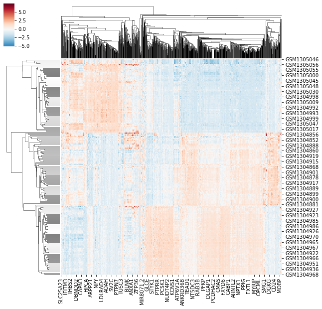

By looking at the heatmap we know two things are being clustered, shown
by the dendrogram. We know the two things are different entities – given
by different entry labels along the rows and columns. However, we don’t
know what they represent (e.g. What does GSMXXXXX mean? And how does it
relate to MOBP?). Further, we can se there’s a difference between the
value plotted in some regions of the graph, but we don’t know what that
value represents. Compare the previous plot with the image below.

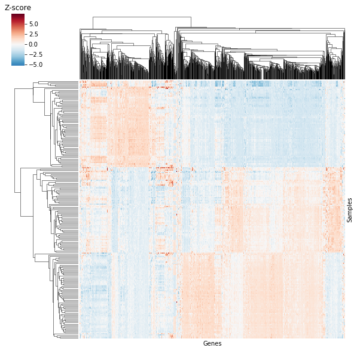

The data is the same as above, but now we know that columns are
repsented by genes and rows are represented by samples: we’re looking at
a :math:`sample \times gene` heatmap! Further, the “Z-score” label by
the color bar lets us know we’re looking at standardized expression
values. You might think we’re losing information by losing the previous
entry labels, but plotted data actually consists of 205 samples and 1000
genes! The previous heatmap definitely didn’t include 1000 gene names or
even 205 sample names, potentially misleading readers on both the number
of genes and samples.

In the above example, we increase clarity by both `removing` information
(entry labels along the rows and columns) and `adding` information (labeling
rows/columns and labeling the color bar). This is often the type of balance we
need to strike when creating clean and clear figures.

Plotting Libraries
==================

While numerical libraries help us generate results, the results would do
little good if we were not able to display them in a digestable manner.
Thankfully, due to the recent surge in popularity/demand for data
scientists and data science tools, there are now more plotting libraries
to choose from in the data science ecosystem than ever before.

Plotting Tools in Python
------------------------

There are many plotting libraries to chose from when plotting in Python.
Many of them excel in one area or another, so knowing what type of graph
you want to create, how you want people to interact with the plot, and
what type of environment you will be working in will help you determine
which library is best for your needs.

Matplotlib
~~~~~~~~~~

*Matplotlib* is the go-to standard for plotting in Python. It’s a
behometh of a package with excellent user control and options that will
cover most, if not all use cases. However, extreme user control comes at
the cost of a fair amount of overhead compared to other, high-level
plotting libraries such as *Seaborn* or *ggplot2* in R.

More information can be found `here <https://matplotlib.org/>`__.

**Example**:

.. code:: python3

    from matplotlib import pyplot as plt
    import seaborn as sns
    plt.rcParams['figure.figsize'] = (10.0, 8.0)
    iris = sns.load_dataset("iris")
    for each in iris['species'].unique():
      subset = iris[iris['species'] == each]
      plt.scatter(x=subset['sepal_length'], y=subset['petal_width'], label=each)
    plt.xlabel('Sepal Length')
    plt.ylabel('Petal Width')
    plt.legend()

.. parsed-literal::

    <matplotlib.legend.Legend at 0x7efd0ca8bba8>

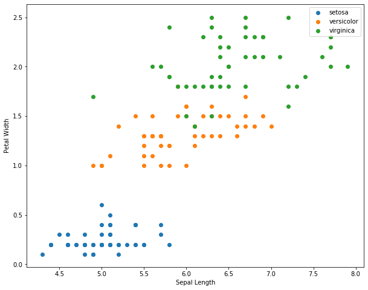

Seaborn
~~~~~~~

*Seaborn* is a high-level statistical plotting library that extends
*matplotlib*. All plots are still created using *matplotlib*, but the
seaborn API makes creating interesting plots much more straight forward.
This allows users to generate complex plots relatively easily, while
still having access to the more in-depth control *matplotlib* offers.

More information can be found `here <https://seaborn.pydata.org/>`__.

**Example**

.. code:: python3

    sns.scatterplot(x='sepal_length', y='petal_width', hue='species', data=iris)

.. parsed-literal::

    <matplotlib.axes._subplots.AxesSubplot at 0x7efd0c816908>

.. image:: intro_files/intro_7_1.png

Bokeh
~~~~~

*Bokeh* is a lower-level plotting library that produces interactive
plots made for modern web browsers. It is an extremely useful library if
you’re making visualizations for a website, server-backed apps, or any
situation where collaborators or viewers would benefit from an
interactive plot.

While *Bokeh* likely has limited use-cases for creating publication
figures, it can still be useful during data exploration or when creating
a supporting website.

More information can be found
`here <https://bokeh.pydata.org/en/latest/>`__.

**Example**

.. code:: python3

    from bokeh.plotting import figure, show, output_file
    from bokeh.io import output_notebook, show
    output_notebook()
    TOOLS="hover,crosshair,pan,wheel_zoom,zoom_in,zoom_out,box_zoom,undo,redo,reset,tap,save,box_select,poly_select,lasso_select,"
    colormap = {'setosa': 'blue', 'versicolor': 'orange', 'virginica': 'green'}
    colors = [colormap[x] for x in iris['species']]
    p = figure(title='Iris Morphology', tools=TOOLS)
    p.xaxis.axis_label = 'Sepal Length'
    p.yaxis.axis_label = 'Petal Width'
    p.circle(iris['sepal_length'], iris['petal_width'], color=colors, size=10)
    show(p)

Altair
~~~~~~

*Altair* is a higher-level, declarative statistical plotting library
that produces interactive plots with less overhead compared to *bokeh*.
However, *Altair* was specifically designed to work in Jupyter Notebooks
and similar technologies (Jupyter Lab, Google Collab, etc.). Therefore,
if you do not work in such environments, it will likely have limited
use. However, if you do work in such environments, it provides a
powerful way to easily explore and visualize data.

More information can be found
`here <https://altair-viz.github.io/index.html>`__.

**Example**

.. code:: python3

    import altair as alt
    
    alt.Chart(iris).mark_circle(size=100).encode(
        alt.X('sepal_length', scale=alt.Scale(zero=False)),
        y='petal_width',
        color='species',
        tooltip=['species', 'sepal_length', 'petal_width']).interactive()

.. image:: intro_files/intro_11_0.png

Plotting Libraries in R
-----------------------

Like Python, R also boasts some very impressive plotting libraries,
namely the famous *ggplot2* library.

Base R
~~~~~~

Unlike Python, R has basic plotting as a part of the standard library.
While lacking some the frills of other plotting tools, you can still
make clean and readable graphs using basic functionality

**Example**

.. code:: R

   plot(iris$Sepal.Length, iris$Petal.Width, col=iris$Species)

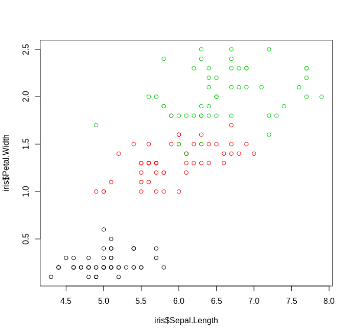

ggplot2
~~~~~~~

If there’s any package that causes the greatest envy between Python and
R users, it is definitely *ggplot2*. *ggplot2* is a declarative plotting
library that implements the so-called “grammar of graphics” framework,
as expalined in the book *Grammar of Graphics* by `Leland
Wilkinson <https://www.springer.com/in/book/9780387245447?source=post_page--------------------------->`__.
It is an extremely user friendly package that makes it easy to produce
nice and clean looking graphs, while also providing power-users with the
ability to easily modify graphs to their liking.

You can find more information about the package
`here <https://ggplot2.tidyverse.org/>`__.

**Example**

.. code:: R

   library(ggplot2)
   ggplot(data=iris, aes(x=Sepal.Length, y=Petal.Width, col=Species)) + 
   geom_point()

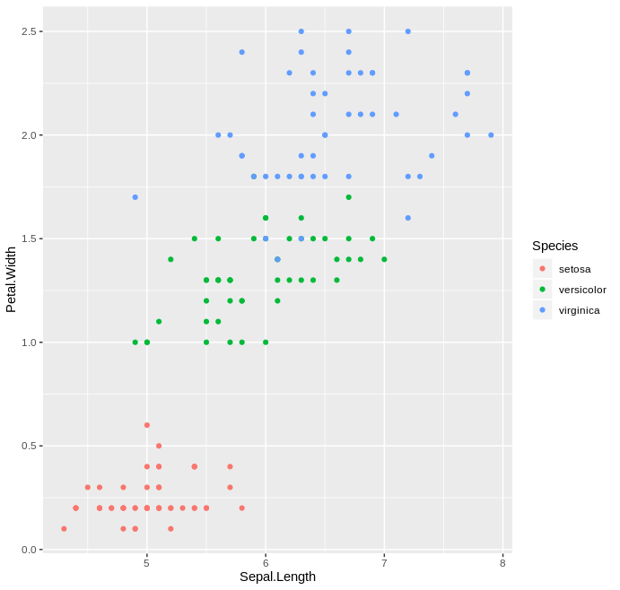

Packages for this workshop
--------------------------

The hands-on portion of this workshop will be done in Python, and we
will be using the *matplotlib* and *Seaborn* packages. Installation of
all required packages can be done by downloading the provided
``environment.yaml`` file, navigating to the directory where the file is
located, and issueing the following command in a terminal window:

``conda create env --name viz --file environment.yaml``

This will install a virtual environment that can be loaded by issuing
the following command:

``conda activate viz``

A virtual environment is just an isolated installion of software – in
this case python packages – that won’t interfere with other
installations of the same software. In this case we’re using a virtual
environment known as a ``conda`` environment, but there are other
options out there such as
`pipenv <https://docs.pipenv.org/en/latest/>`__.

Matplotlib Basics
-----------------

As mentioned above, *matplotlib* is a massive package, and it would be
impossible to cover all aspects of the library in a single workshop. For
now, we’ll just be going over the extreme basic to get started.

.. code:: python3

    # To interact with matplotlib we first have to import it.
    # Generally, instead of importing the entire package, we import the pyplot module
    from matplotlib import pyplot as plt  # it is cononical to import pyplot as "plt"
    import numpy as np  # also cononical to import numpy as np, numpy is a numerical library
    
    # get values from -20, 20
    x = np.arange(-20, 21)
    # calculate the square of each value
    y = x ** 2
    # plot the values as line plot using the "plot" function
    plt.plot(x, y)

.. parsed-literal::

    [<matplotlib.lines.Line2D at 0x7efce6fe7748>]

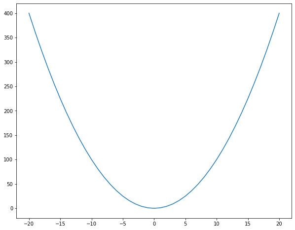

**Note** If you are working in a non-notebook environment (i.e. a python
script or another python interpreter), you’ll need to issue the command
``plt.show()`` in order to view the plot window.

.. code:: python3

    # plot the individual data points using a scatter plot
    plt.scatter(x, y)

.. parsed-literal::

    <matplotlib.collections.PathCollection at 0x7efce6fd4978>

.. image:: intro_files/intro_16_1.png

.. code:: python3

    # make the same plot, but with red stars!
    plt.scatter(x, y, color='red', marker='*')

.. parsed-literal::

    <matplotlib.collections.PathCollection at 0x7efce6f447f0>

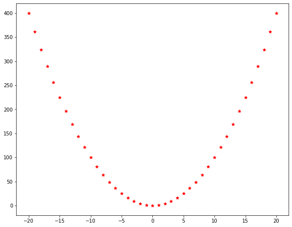

``color="red"`` and ``marker="*"`` are called keyword arguments: they
are optional styling arguments that are set by passing a key (e.g
“color”) and a value (“red”). There are a lot of possible keyword
arguments you can change, but they are generally consistent across
plotting functions.

.. code:: python3

    # plot data points as well as the line graph
    plt.scatter(x, y)
    plt.plot(x, y)

.. parsed-literal::

    [<matplotlib.lines.Line2D at 0x7efce6f11be0>]

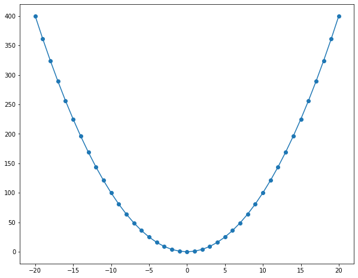

.. code:: python3

    # plot a bar plot of counts 10, 7, and 5 for groups A, B, and C, respectively
    plt.bar(['A', 'B', 'C'], [10, 7, 5])

.. parsed-literal::

    <BarContainer object of 3 artists>

.. image:: intro_files/intro_20_1.png

.. code:: python3

    # plot a histogram of sampled values from a standard normal distribution
    norm_x = np.random.randn(1000)
    __ = plt.hist(norm_x)

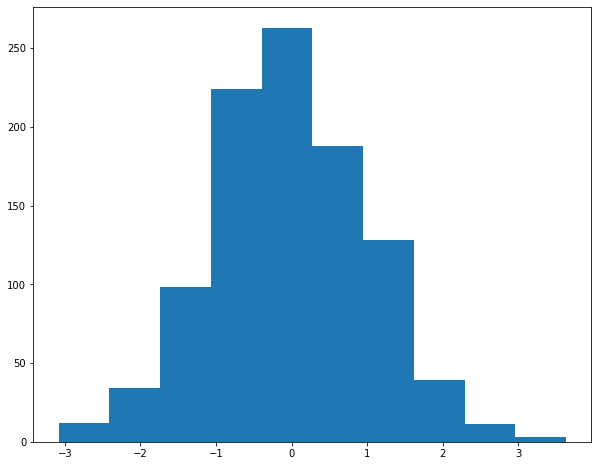

.. code:: python3

    # plot the square of the provided data label
    # label axes using plt.xlabel and plt.ylabel functions
    data = np.array([55.3846,97.1795,51.5385,96.0256, 46.1538,94.4872,42.8205,91.4103,
    40.7692,88.3333,38.7179,84.8718,35.641,79.8718,33.0769,77.5641,
    28.9744,74.4872,26.1538,71.4103,23.0769,66.4103,22.3077,61.7949,
    22.3077,57.1795,23.3333,52.9487,25.8974,51.0256,29.4872,51.0256,
    32.8205,51.0256,35.3846,51.4103,40.2564,51.4103,44.1026,52.9487,
    46.6667,54.1026,50,55.2564,53.0769,55.641,56.6667,56.0256,
    59.2308,57.9487,61.2821,62.1795,61.5385,66.4103,61.7949,69.1026,
    57.4359,55.2564,54.8718,49.8718,52.5641,46.0256,48.2051,38.3333,
    49.4872,42.1795,51.0256,44.1026,45.3846,36.4103,42.8205,32.5641,
    38.7179,31.4103,35.1282,30.2564,32.5641,32.1795,30,36.7949,
    33.5897,41.4103,36.6667,45.641,38.2051,49.1026,29.7436,36.0256,
    29.7436,32.1795,30,29.1026,32.0513,26.7949,35.8974,25.2564,
    41.0256,25.2564,44.1026,25.641,47.1795,28.718,49.4872,31.4103,
    51.5385,34.8718,53.5897,37.5641,55.1282,40.641,56.6667,42.1795,
    59.2308,44.4872,62.3077,46.0256,64.8718,46.7949,67.9487,47.9487,
    70.5128,53.718,71.5385,60.641,71.5385,64.4872,69.4872,69.4872,
    46.9231,79.8718,48.2051,84.1026,50,85.2564,53.0769,85.2564,
    55.3846,86.0256,56.6667,86.0256,56.1538,82.9487,53.8462,80.641,
    51.2821,78.718,50,78.718,47.9487,77.5641,29.7436,59.8718,
    29.7436,62.1795,31.2821,62.5641,57.9487,99.4872,61.7949,99.1026,
    64.8718,97.5641,68.4615,94.1026,70.7692,91.0256,72.0513,86.4103,
    73.8462,83.3333,75.1282,79.1026,76.6667,75.2564,77.6923,71.4103,
    79.7436,66.7949,81.7949,60.2564,83.3333,55.2564,85.1282,51.4103,
    86.4103,47.5641,87.9487,46.0256,89.4872,42.5641,93.3333,39.8718,
    95.3846,36.7949,98.2051,33.718,56.6667,40.641,59.2308,38.3333,
    60.7692,33.718,63.0769,29.1026,64.1026,25.2564,64.359,24.1026,
    74.359,22.9487,71.2821,22.9487,67.9487,22.1795,65.8974,20.2564,
    63.0769,19.1026,61.2821,19.1026,58.7179,18.3333,55.1282,18.3333,
    52.3077,18.3333,49.7436,17.5641,47.4359,16.0256,44.8718,13.718,
    48.7179,14.8718,51.2821,14.8718,54.1026,14.8718,56.1538,14.1026,
    52.0513,12.5641,48.7179,11.0256,47.1795,9.8718,46.1538,6.0256,
    50.5128,9.4872,53.8462,10.2564,57.4359,10.2564,60,10.641,
    64.1026,10.641,66.9231,10.641,71.2821,10.641,74.359,10.641,
    78.2051,10.641,67.9487,8.718,68.4615,5.2564,68.2051,2.9487,
    37.6923,25.7692,39.4872,25.3846,91.2821,41.5385,50,95.7692,
    47.9487,95,44.1026,92.6923])
    __ = plt.hist(data)
    plt.xlabel('Values')
    plt.ylabel('Counts')

.. parsed-literal::

    Text(0, 0.5, 'Counts')

.. image:: intro_files/intro_22_1.png

.. code:: python3

    # make the data into a 142 by 2 data matrix
    # plot the values as a scatterplot
    # label the axes and set a title using the "title" function
    hi = data.reshape(142, 2)
    plt.scatter(hi[:, 0], hi[:, 1])
    plt.xlabel('x')
    plt.ylabel('y')
    plt.title("Where's Sam Neill When You Really Need Him?", loc="left")

.. parsed-literal::

    Text(0.0, 1.0, "Where's Sam Neill When You Really Need Him?")

.. image:: intro_files/intro_23_1.png

Data Frames
===========

A data frame is a **two-dimensional** data structure used for storing
data tables. It is componsed of lists (or vectors in R) of equal length.
Data frames contain a **header** (column names), **row names**, and the
actual data stored in **cells**.

Today’s workshop will focus on using data frames in python (using the
**pandas** library), but this data structure is also commonly used in R.
For more information on data frames in R, please reference the following
resource: http://www.r-tutor.com/r-introduction/data-frame

Creating a Data Frame
^^^^^^^^^^^^^^^^^^^^^

There are numerous ways for creating a data frame using pandas, and they
are enumerated here:
https://www.geeksforgeeks.org/creating-a-pandas-dataframe/ Choose the
method that works best for your data. An example of creating a
dictionary from a set of lists is below:

.. code:: python3

    ### Example Data Frame
    # Import Libraries
    import pandas as pd
    
    # Create Lists of Data
    avengers = ['Iron Man', 'Captain America', 'Thor', 'Black Widow', 'Hawkeye', 'Hulk']
    num_appearances = [9, 9, 7, 8, 4, 7]
    num_lines = [2788, 924, 856, 463, 148, 472]
    
    # Make Data Frame
    dict = {'Avengers': avengers, 'Num_Appearances': num_appearances, 'Num_Lines': num_lines}
    marvel_stats = pd.DataFrame(dict) 
    print(marvel_stats)

.. parsed-literal::

              Avengers  Num_Appearances  Num_Lines
    0         Iron Man                9       2788
    1  Captain America                9        924
    2             Thor                7        856
    3      Black Widow                8        463
    4          Hawkeye                4        148
    5             Hulk                7        472

Loading (Reading-In) Data as a Data Frame
^^^^^^^^^^^^^^^^^^^^^^^^^^^^^^^^^^^^^^^^^

More commonly, your data will be stored in an excel or .csv file. In
order to work with these data as a data frame, you can read in the data
using built-in pandas functions.

.. code:: python3

    # Read in a csv file
    #csv_data = pd.read_csv("csv_example.csv")
    # Read in an excel file
    #excel_data = pd.read_excel('excel_samples.xlsx')

Data Frameifying Data
^^^^^^^^^^^^^^^^^^^^^

Oftentimes, your tabular data is not stored in this data frame
structure, e.g. is “unstacked” and common attributes are spread across
different columns. For these cases it is important to be able to
**reshape** your data into the data frame structure. This reshaped data
is sometimes called *tidy* data.

**TASK:** Read about *tidy* data `here. <https://vita.had.co.nz/papers/tidy-data.pdf>`__ Understanding
effective data pre-processing (tidying) is crucial to efficient data
visualization!

Some useful functions for reshaping data with pandas:

-  **stack()**  

   -  Stack method works with the MultiIndex objects in DataFrame, it
   returning a DataFrame with an index with a new inner-most level of
   row labels. It changes the wide table to a long table.
   
-  **unstack()**  

   -  Unstack is similar to stack method, It also works with multi-index
   objects in dataframe, producing a reshaped DataFrame with a new
   inner-most level of column labels.
   
-  **melt()**

   -  Melt reshapes the dataframe from wide format to long format. It
      uses the “id_vars[‘col_names’]” to melt the dataframe by column
      names.

*Note:* In R, it is useful to use the ‘tidyverse’ packages to reshape
data!

Types of Plots
==============

Relational
----------

| Relational plots are a type that many people are comfortable using. It
  displays the relationship between two numerical variables. The intent
  of these plots is to draw a causal relationship between the two
  variables.
  
| **Biological Example:** Expression of one gene over time
| **Types of Plots:** Scatter plot, line plot
| **Seaborn API:**
| - Seaborn
  `Scatterplot <https://seaborn.pydata.org/generated/seaborn.scatterplot.html#seaborn.scatterplot>`__:
  Draws a scatter plot
| - Seaborn
  `Lineplot <https://seaborn.pydata.org/generated/seaborn.lineplot.html#seaborn.lineplot>`__:
  Draws a line plot 
  - Seaborn
  `Relplot <https://seaborn.pydata.org/generated/seaborn.relplot.html#seaborn.relplot>`__:
  Figure-level interface for drawing relational plots onto a
  **FacetGrid**.
| - Data must be passed in a long-form DataFrame with variables
  specified by passing strings to x, y, and other parameters - Use the
  *kind* parameter to specify which underlying plotting fucntion to use
  (e.g. kind = “scatter”)
| - Can do the same things as the figure-level functions (scatterplot()
  and lineplot(), but can also facet and do other nice features)

.. code:: python3

    # Load Sample Data
    tips = sns.load_dataset("tips")
    
    # Use scatterplot() to generate a scatter plot
    plt.title("This Scatter Plot was Made with scatterplot()")
    sns.scatterplot(x="total_bill", y="tip", hue="day", data=tips)
    
    # Use relplot() to generate a scatter plot
    g1 = sns.relplot(x="total_bill", y="tip", hue="day", data=tips, kind='scatter')
    g1.fig.suptitle("This Scatter Plot was Made with relplot()");

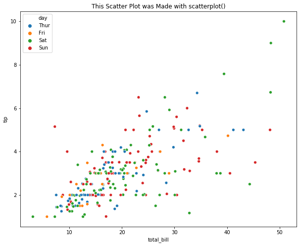

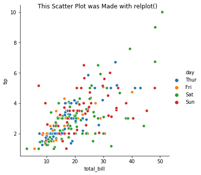

.. code:: python3

    # Load Sample Data
    fmri = sns.load_dataset("fmri")
    
    # Use lineplot() to generate a line plot
    plt.title("These Line Plots were Made with lineplot()");
    sns.lineplot(x="timepoint", y="signal", hue="event", data=fmri)
    
    # Use relplot() to generate a line plot
    g3 = sns.relplot(x="timepoint", y="signal", hue="event", style="event", 
                     col="region", kind="line", data=fmri)
    g3.fig.suptitle("These Line Plots were Made with relplot()");

.. image:: intro_files/intro_31_0.png

.. image:: intro_files/intro_31_1.png

Categorical
-----------

| Categorical plots show the relationship between one numerical variable
  and one or more categorical variables.
  
| **Types of Plots:** 
| \* Categorical Scatter Plots \* Categorical
  Distribution Plots \* Categorical Estimate Plots

| **Seaborn API:**
| \* Categorical Scatter Plots \* `Strip
  plot <https://seaborn.pydata.org/generated/seaborn.stripplot.html#seaborn.stripplot>`__
  \* `Swarm
  plot <https://seaborn.pydata.org/generated/seaborn.swarmplot.html#seaborn.swarmplot>`__
  \* Categorical Distribution Plots \* `Box
  plot <https://seaborn.pydata.org/generated/seaborn.boxplot.html#seaborn.boxplot>`__
  \* `Violin
  plot <https://seaborn.pydata.org/generated/seaborn.violinplot.html#seaborn.violinplot>`__
  \* Categorical Estimate Plots \* `Point
  plot <https://seaborn.pydata.org/generated/seaborn.pointplot.html#seaborn.pointplot>`__
  \* `Bar
  plot <https://seaborn.pydata.org/generated/seaborn.barplot.html#seaborn.barplot>`__
  \* `Count
  plot <https://seaborn.pydata.org/generated/seaborn.countplot.html#seaborn.countplot>`__
  \* Seaborn
  `Catplot <https://seaborn.pydata.org/generated/seaborn.catplot.html#seaborn.catplot>`__:
  Figure-level interface for drawing categorical plots onto a
  **FacetGrid**. \* Data must be passed in a long-form DataFrame with
  variables specified by passing strings to x, y, and other parameters
  \* Use the *kind* parameter to specify which underlying plotting
  fucntion to use (e.g. kind = “scatter”)
| \* Can do the same things as the figure-level functions, but can also
  facet and do other nice features

**Excercise**: Look at the different representations of the data below.
Which plot(s) are best suited for showing the relationship between
amount of excercise and pulse? Are there any plots that are misleading
or innaporpriate?

.. code:: python3

    # Load Sample Data
    exercise = sns.load_dataset("exercise")
    g = sns.catplot(x="time", y="pulse", hue="kind", data=exercise, kind="strip")
    g. fig.suptitle("Strip Plot (Default)");
    g = sns.catplot(x="time", y="pulse", hue="kind", data=exercise, kind="swarm")
    g. fig.suptitle("Swarm Plot");
    g = sns.catplot(x="time", y="pulse", hue="kind", data=exercise, kind="box")
    g. fig.suptitle("Box Plot");
    g = sns.catplot(x="time", y="pulse", hue="kind", data=exercise, kind="violin")
    g. fig.suptitle("Violin Plot")
    g = sns.catplot(x="time", y="pulse", hue="kind", data=exercise, kind="point")
    g. fig.suptitle("Point Plot");
    g = sns.catplot(x="time", y="pulse", hue="kind", data=exercise, kind="bar")
    g. fig.suptitle("Bar Plot");
    g = sns.catplot(y="pulse", hue="kind", data=exercise, kind="count")
    g. fig.suptitle("Count Plot");

.. image:: intro_files/intro_33_0.png

.. image:: intro_files/intro_33_1.png

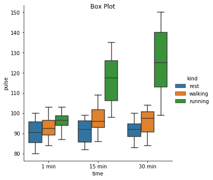

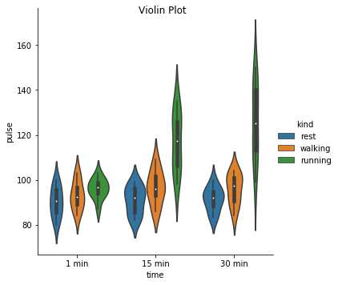

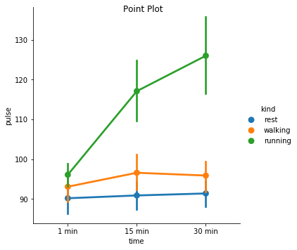

.. image:: intro_files/intro_33_5.png

.. image:: intro_files/intro_33_6.png

Matrix Plots
------------

Matrix plots – often referred ot as “heatmaps” – take an
:math:`N \times M` data matrix and plot each cell value as a specified
color. The color of each cell is determine by the value in the cell, and
where the value falls along the specific color map – note: a color map
is a mapping from a value range (e.g. :math:`[0, 1]`) to specified
colors representing these values (e.g. the closer to zero a number is
the more blue it will appear, and the closer to 1 the value is the more
red the color will be). In this way, matrix plots allow the
visualization of multidimensional data fairly easily. In Bioinformatics,
these plots are often used to display gene expression pattens for a
large number of genes across a large number of samples.

**Example** Using the ``heatmap`` function in seaborn, plot the number
of flight passengers for each month through the years 1949 - 1960.

.. code:: python3

    # Load in the dataset
    flights = sns.load_dataset("flights")
    print("Upon loading, the `flights` dataset is 'long' formatted.\n")
    print(flights.head())
    print('\n\n')
    print("By 'pivoting' the dataset, we get a data matrix of (months x years)" +
          " and will be able to plot the data as a heatmap.\n")
    flights = flights.pivot("month", "year", "passengers")
    print(flights.head())
    ax = sns.heatmap(flights, cmap="viridis")

.. parsed-literal::

    Upon loading, the `flights` dataset is 'long' formatted.
    
       year     month  passengers
    0  1949   January         112
    1  1949  February         118
    2  1949     March         132
    3  1949     April         129
    4  1949       May         121
    
    
    
    By 'pivoting' the dataset, we get a data matrix of (months x years) and will be able to plot the data as a heatmap.
    
    year      1949  1950  1951  1952  1953  1954  1955  1956  1957  1958  1959  \
    month                                                                        
    January    112   115   145   171   196   204   242   284   315   340   360   
    February   118   126   150   180   196   188   233   277   301   318   342   
    March      132   141   178   193   236   235   267   317   356   362   406   
    April      129   135   163   181   235   227   269   313   348   348   396   
    May        121   125   172   183   229   234   270   318   355   363   420   
    
    year      1960  
    month           
    January    417  
    February   391  
    March      419  
    April      461  
    May        472  

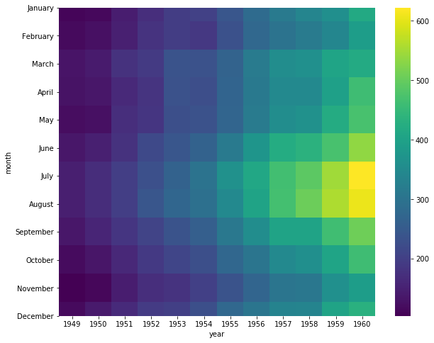

To better visualize patterns in the data, it is often useful to cluster
rows and columns of a data matrix *before* plotting the data matrix as a
heatmap. In seaborn, this is done with the ``clustermap()`` function.

**Example** To visualize pattens between the number of passengers
throughout years and months, plot a clustered heatmap.

.. code:: python3

    sns.clustermap(flights, cmap='viridis')

.. parsed-literal::

    <seaborn.matrix.ClusterGrid at 0x7efce51ca5f8>

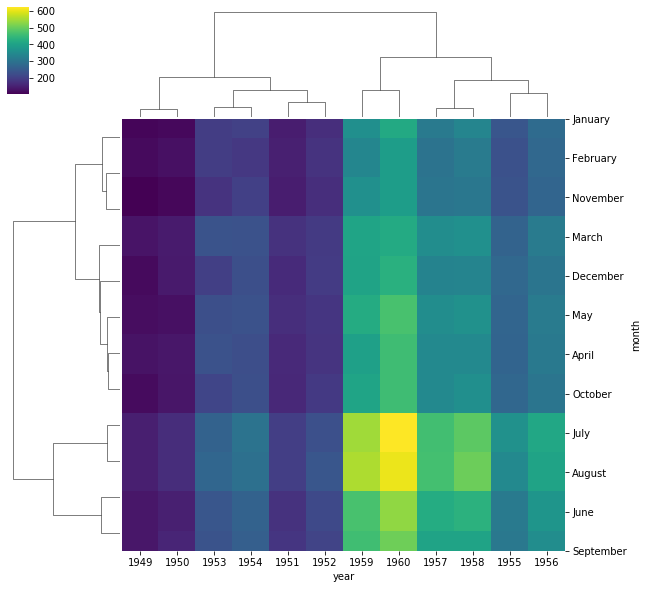

When looking at a heatmap – even when clustered – it can be difficult to
adequately visualize distinct clusters. Heatmaps, and clustered
heatmaps, can also be used on distance matrices to visualize distances
between samples or features to better visualize simmilarity between
categories of interest.

**Example** Plot a clustered heatmap showing the distance between the
number of passengers for each month throughout the years.

.. code:: python3

    from scipy import spatial
    import pandas as pd
    # calculate pairwise euclidean distances using scipy
    dist_matrix = spatial.distance.squareform(spatial.distance.pdist(flights.T))
    dist_df = pd.DataFrame(dist_matrix, columns=flights.index, index=flights.index)
    sns.clustermap(dist_df, cmap='viridis')

.. parsed-literal::

    /home/dakota/miniconda3/envs/viz/lib/python3.7/site-packages/seaborn/matrix.py:603: ClusterWarning: scipy.cluster: The symmetric non-negative hollow observation matrix looks suspiciously like an uncondensed distance matrix
      metric=self.metric)

.. parsed-literal::

    <seaborn.matrix.ClusterGrid at 0x7efce503beb8>

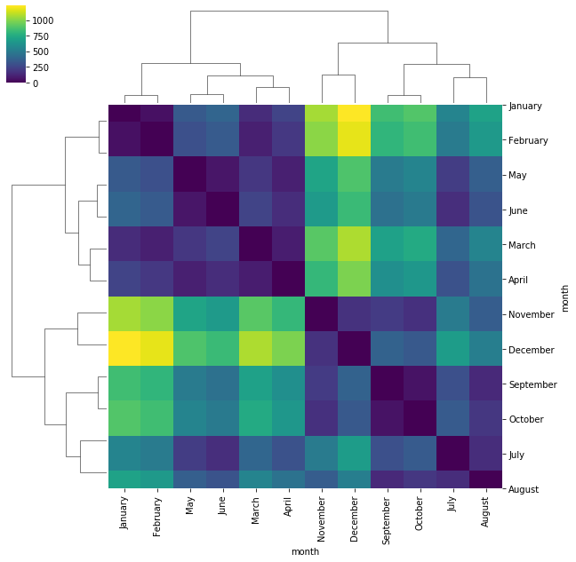

Distribution Plots
------------------

The basis for all parametric statistical analysis are the underlying
distributions of the sample data. Therefore, it is often informative to
plot the distribution of features of interest. This can either be done
using a histogram, modelling the underlying distribution, or even
plotting a histogram against an assumed distribution for comparison. In
either case, *Seaborn* makes this easy using the ``distplot`` function.

**Example**

Plot the distribution of sepal lengths in the iris dataset as a
histogram.

.. code:: python3

    sns.distplot(iris['sepal_length'], kde=False)

.. parsed-literal::

    <matplotlib.axes._subplots.AxesSubplot at 0x7efce51ad2e8>

.. image:: intro_files/intro_41_1.png

If we prefer to use *matplotlib* directly, instead of using *Seaborn* we
can simply use the ``hist`` function.

**Example** Plot a histogram of petal width for each species in the iris
dataset. Plot them on the same graph.

.. code:: python3

    for each in iris['species'].unique():
      subset = iris[iris['species'] == each]
      plt.hist(subset['petal_width'], bins=5, label=each, alpha=0.5)

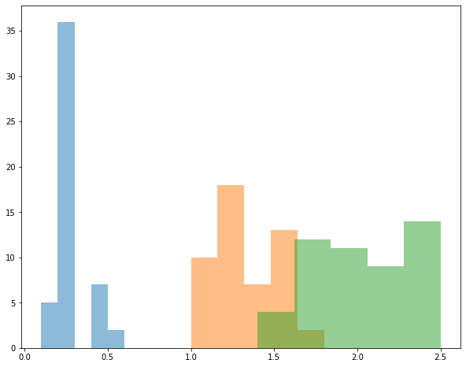

Sometimees we might prefer to plot the estimated distribution with a
probability distribution instead of using a histogram. In *Seaborn*,
this can be done by setting the parameter ``kde=True`` in the
``distplot`` function.

**Example** Plot the estimated distrubtion of petal width for each
species in the iris dataset. Note: while many *Seaborn* functions allow
you to pass a vector/Series/array of labels that will automatically
segegrate samples, this is not true for ``distplot``, and we must do it
ourselves.

.. code:: python3

    # create an axes object to plot on
    ax = plt.subplot()
    colormap = {x:c for x, c in zip(iris['species'].unique(), ['blue', 'orange', 'green'])}
    # subset the dataset to each species, plot on the shared axes object.
    for each in iris['species'].unique():
      subset = iris[iris['species'] == each]
      sns.distplot(subset['petal_width'], hist=False, kde=True, color=colormap[each], ax=ax,
                   kde_kws={'shade': True})

.. image:: intro_files/intro_45_0.png

While plotting univariate distriubtions is nice, we can also plot joint
distributions between two random variables. These plots are useful if we
want to see the relationship between two features. To do so using
*Seaborn*, we simply use the ``kdeplot`` function.

**Example** Plot the joint distrubtion of petal width and sepal length
for all samples in the iris dataset.

.. code:: python3

    sns.kdeplot(iris['petal_width'], iris['sepal_length'], shade=True, cmap='magma', cbar=True)

.. parsed-literal::

    <matplotlib.axes._subplots.AxesSubplot at 0x7efce4f06dd8>

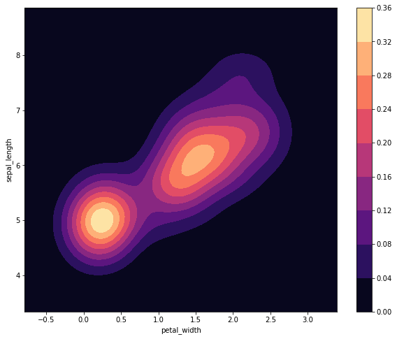

Unlike previous plots, we can not easily plot the species-dependent
distributions all on the same graph. Well, we could if we wanted to, but
it could get a little messy.

**Example** Plot a joint distriubtion of sepal length and petal width
all on the same graph. Plot each species as a different color.

.. code:: python3

    # create an axes object to plot on
    ax = plt.subplot()
    # subset the dataset to each species, plot on the shared axes object.
    colormaps = ['Blues', 'Greens', 'Reds']
    for i, each in enumerate(iris['species'].unique()):
      subset = iris[iris['species'] == each]
      sns.kdeplot(subset['petal_width'], subset['sepal_length'], ax=ax,
                  shade=True, cmap=colormaps[i], alpha=0.5)

.. image:: intro_files/intro_49_0.png

That’s defnitely pretty gross. It would probably be better to plot each
distribution on its own graph and show the three distributions
side-by-side. To do that, we’ll need to use the ``subplots`` command
from matplob lib.

**Example** Plot the joint distribution of petal width and sepal length
for each species on a different graph. Display the plots side-by-side on
the same figure.

.. code:: python3

    # create an axes object to plot on
    fig, axes = plt.subplots(nrows=1, ncols=3)
    # subset the dataset to each species, plot on the shared axes object.
    colormaps = ['Blues', 'Greens', 'Reds']
    for i, each in enumerate(iris['species'].unique()):
      subset = iris[iris['species'] == each]
      sns.kdeplot(subset['petal_width'], subset['sepal_length'], ax=axes[i],
                  shade=True, cmap=colormaps[i])

.. image:: intro_files/intro_51_0.png

Seaborn Cheat Sheet
-------------------

`Seaborn Cheat
Sheet <https://s3.amazonaws.com/assets.datacamp.com/blog_assets/Python_Seaborn_Cheat_Sheet.pdf>`__
