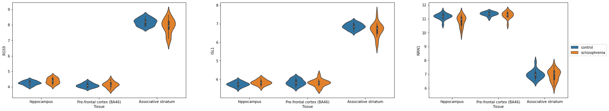
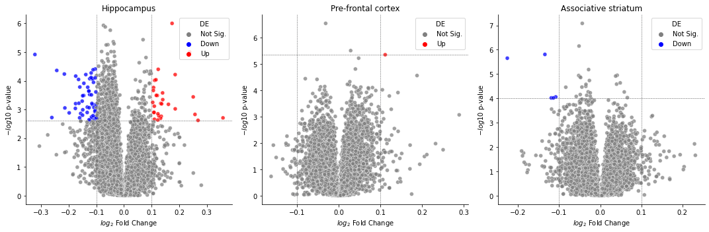

============
Introduction
============

Welcome to the in-class portion of the visualization workshop in Python! Feel
free to work in either a Jupyter Notebook or a typical text editor/IDE,
depending on your preference.

If you would like to use a Notebook, you can download that here:

:download:`Notebook <files/workshop.ipynb>`

Otherwise, you can follow along here and use the following skeleton code
provided in a Python file:

:download:`Python <files/workshop.py>`.

In case you don't finish, there are, of course, solutions provided:

:download:`Notebook Solutions<files/solutions.ipynb>`.

:download:`Python Solutions<files/solutions.py>`.

With that out of the way, let's get started!

The Data Set
------------

In today’s workshop, we will revisit the data set you worked with in the
Machine Learning workshop. As a refresher: this data set is from the
GSE53987 dataset on Bipolar disorder (BD) and major depressive disorder
(MDD) and schizophrenia:

Lanz TA, Joshi JJ, Reinhart V, Johnson K et al. STEP levels are
unchanged in pre-frontal cortex and associative striatum in post-mortem
human brain samples from subjects with schizophrenia, bipolar disorder
and major depressive disorder. PLoS One 2015;10(3):e0121744. PMID:
25786133

This is a microarray data on platform GPL570 (HG-U133_Plus_2, Affymetrix
Human Genome U133 Plus 2.0 Array) consisting of 54675 probes.

The raw CEL files of the GEO series were downloaded, `frozen-RMA normalized <https://bioconductor.org/packages/release/bioc/html/frma.html>`_ , and the probes have been converted to HUGO gene symbols using the `annotate package <https://www.bioconductor.org/packages/release/bioc/html/annotate.html>`_ averaging on genes. The sample clinical data (meta-data) was parsed from the `series matrix file <ftp://ftp.ncbi.nlm.nih.gov/geo/series/GSE53nnn/GSE53987/matrix/>`_. You can download it here:

:download:`GSE53987_combined.csv <data/GSE53987_combined.csv>`

In total there are 205 rows consisting of 19 individuals diagnosed with
BPD, 19 with MDD, 19 schizophrenia and 19 controls. Each sample has gene
expression from 3 tissues (post-mortem brain). There are a total of
13768 genes (numeric features) and 10 meta features and 1 ID (GEO sample
accession):

-  Age
-  Race (W for white and B for black)
-  Gender (F for female and M for male)
-  Ph: pH of the brain tissue
-  Pmi: post mortal interval
-  Rin: RNA integrity number
-  Patient: Unique ID for each patient. Each patient has up to 3 tissue
   samples. The patient ID is written as disease followed by a number
   from 1 to 19
-  Tissue: tissue the expression was obtained from.
-  Disease.state: class of disease the patient belongs to: bipolar,
   schizophrenia, depression or control.
-  source.name: combination of the tissue and disease.state

Workshop Goals
^^^^^^^^^^^^^^

| This workshop will walk you through an analysis of the GSE53987
  microarray data set. This workshop has the following three tasks:
| 1. Visualize the demographics of the data set
| 2. Cluster gene expression data and appropriately visualize the
  cluster results 3. Compute differential gene expression and visualize
  the differential expression

Each task has a **required** section and a **bonus** section. Focus on
completing the three **required** sections first, then if you have time
at the end, revisit the **bonus** sections.

Finally, as this is your final workshop, we hope that you will this as
an opportunity to integrate the different concepts that you have learned
in previous workshops.

Workshop Logistics
^^^^^^^^^^^^^^^^^^

As mentioned in the pre-workshop documentation, you can do this workshop
either in a Jupyter Notebook, or in a python script. Please make sure
you have set-up the appropriate environment for youself. This workshop
will be completed using “paired-programming” and the “driver” will
switch every 15 minutes. Also, we will be using the python plotting
libraries matplotlib and seaborn.

Task 0: Import Libraries and Data
---------------------------------

-  Download the data set (above) as a .csv file
-  Initialize your script by running the first cell and ensuring the data file
   is pointing to the correct location on your local computer.

.. code:: python3

    # Import Necessary Libraries
    import pandas as pd
    import numpy as np
    import seaborn as sns
    from sklearn import cluster, metrics, decomposition
    from matplotlib import pyplot as plt
    import itertools
    data = pd.read_csv('GSE53987_combined.csv', index_col=0)
    genes = data.columns[10:]

Task 1: Visualize Dataset Demographics
--------------------------------------

Required Workshop Task:
^^^^^^^^^^^^^^^^^^^^^^^

1. Use the skeleton code to write 3 plotting functions:

   1. plot_distribution()

      -  Returns a distribution plot object given a dataframe and one
         observation

   2. plot_relational()

      -  Returns a distribution plot object given a dataframe and (x,y)
         observations

   3. plot_categorical()

      -  Returns a categorical plot object given a dataframe and (x,y)
         observations

2. Use these functions to produce the following plots:

   1. Histogram of patient ages
   2. Histogram of gene expression for 1 gene
   3. Scatter plot of gene expression for 1 gene by ages
   4. Box plot of gene expression for 1 gene by disease state
   5. Violin plot of gene expression for 1 gene by Tissue

| Your plots should satisfy the following critical components:
| \* Axis titles \* Figure title \* Legend (if applicable) \* Be
  readable

Bonus Task:
^^^^^^^^^^^

1. Return to these functions and include functionality to customize
   color palettes, axis legends, etc. You can choose to define your own
   plotting “style” and keep that consistent for all of your plotting
   functions.
2. Clean up any axis or tick labels so that all labels are clearly
   visible. This may include playing with text size, rotation, or some
   other parameter.

.. code:: python3

    # Function to Plot a Distribtion
    def plot_distribution(df, obs1, obs2=''):
        """
        Create a distribution plot for at least one observation
        
        Arguments:
            df (pandas data frame): data frame containing at least 1 column of numerical values
            obs1 (string): observation to plot distribution on
            obs2 (string, optional)
        Returns:
            axes object
        """
        fig, ax = plt.subplots()
        return ax
    
    # Function to Plot Relational (x,y) Plots 
    def plot_relational(df, x, y, hue=None, kind=None):
        """
        Create a plot for an x,y relationship (default = scatter plot)
        Optional functionality for additional observations.
        
        Arguments:
            df (pandas data frame): data frame containing at least 2 columns of numerical values
            x (string): observation for the independent variable
            y (string): observation for the dependent variable
            hue (string, optional): additional observation to color the plot on
            kind (string, optional): type of plot to create [scatter, line]
        Returns:
            axes object
        """
        fig, ax = plt.subplots()
        return ax
    
    def plot_categorical(df, x, y, hue=None, kind=None):
        """
        Create a plot for an x,y relationship where x is categorical (not numerical)
        
        Arguments:
            df (pandas data frame): data frame containing at least 2 columns of numerical values
            x (string): observation for the independent variable (categorical)
            y (string): observation for the dependent variable
            hue (string, optional): additional observation to color the plot on
            kind (string, optional): type of plot to create. Options should include at least: 
            strip (default), box, and violin
        """
        fig, ax = plt.subplot()
        return ax
    
    def main():
        """
        Generate the following plots:
        1. Histogram of patient ages
        2. Histogram of gene expression for 1 gene
        3. Scatter plot of gene expression for 1 gene by ages 
        4. Scatter plot of gene expression for 1 gene by disease state 
        """
        

.. code:: python3

    def bh_adjust(pvalues):
        from scipy.stats import rankdata
        ranked_pvalues = rankdata(pvalues)
        fdr = pvalues * len(pvalues) / ranked_pvalues
        fdr[fdr > 1] = 1
    
        return fdr
    
    def differential_expression(data, group_col, features, reference=None):
        """
        Perform a one-way ANOVA across all provided features for a given grouping.
        
        Arguments
        ---------
        
            data : (pandas.DataFrame)
                DataFrame containing group information and feature values.
            group_col : (str)
                Column in `data` containing sample group labels.
            features : (list, numpy.ndarray):
                Columns in `data` to test for differential expression. Having them
                be gene names would make sense. :thinking:
            reference : (str, optional)
                Value in `group_col` to use as the reference group. Default is None,
                and the value will be chosen.
                
        Returns
        -------
            pandas.DataFrame
                A DataFrame of differential expression results with columns for
                fold changes between groups, maximum fold change from reference,
                f values, p values, and adjusted p-values by Bonferroni correction.
        """
        if group_col not in data.columns:
            raise ValueError("`group_col` {} not found in data".format(group_col))
        if any([x not in data.columns for x in features]):
            raise ValueError("Not all provided features found in data.")
        if reference is None:
            reference = data[group_col].unique()[0]
            print("No reference group provided. Using {}".format(reference))
        elif reference not in data[group_col].unique():
            raise ValueError("Reference value {} not found in column {}.".format(
                             reference, group_col))
        by_group = data.groupby(group_col)
        reference_avg = by_group.get_group(reference).loc[:,features].mean()
        values = []
        results = {}
        for each, index in by_group.groups.items():
            values.append(data.loc[index, features])
            if each !=  reference:
                key = f"{each.replace(' ', '_')}_foldchange"
                results[key] = np.log2(data.loc[index, features].mean()) \
                             - np.log2(reference_avg)
        fold_change_cols = list(results.keys())
        fvalues, pvalues = stats.f_oneway(*values)
        results['f_value'] = fvalues
        results['p_value'] = pvalues
        results['neg_log10_pvalue'] = - np.log10(pvalues)
        results['adj_p_value'] = bh_adjust(pvalues)
        results_df = pd.DataFrame(results)
        def largest_deviation(x):
            i = np.where(abs(x) == max(abs(x)))[0][0]
            return x[i]
        if len(fold_change_cols) > 0:
            results_df['max_foldchange'] = results_df[fold_change_cols].apply(
                                               lambda x: largest_deviation(x.values), axis=1)
    
        return results_df  

Task 2: Volcano Plots
---------------------

Volcano plots are ways to showcase the number of differentially
expressed genes found during high throughput sequencing analysis. Log
fold changes are plotted along the x-axis, while p-values are plotted
along the y-axis. Genes are marked significant if they exceed some
absolute Log fold change theshold **as well** some p-value level for
significance. This can be seen in the plot below.

.. image:: images/volcanoplot.png

Your first task will be to generate some Volcano plots:

Requirements
^^^^^^^^^^^^

1. Use the provided function to perform an ANOVA (analysis of variance)
   between control and experimental groups in each tissue.

   -  Perform a separate analysis for each tissue.

2. Implement the skeleton function to create a volcano plot to visualize
   both the log fold change in expression values and the p-values from
   the ANOVA comparison
3. Highlight significant genes with distinct colors

**hints**: 1. You might find the ``palette`` argument for seaborn plots
helpful when coloring each gene 2. Volcano plots are typically a little
strange where *significance* is determined by **adjusted** p-values, but
**raw** -:math:`log_{10}` p-values are plotted along the y-axis

.. code:: python3

    def volcano_plot(data, x_col, y_col, sig_col, sig_thresh, fc_thresh):
        """
        Generate a volcano plot to showcasing differentially expressed genes.
        
        Parameters
        ----------
            data : (pandas.DataFrame)
                A data frame containing differential expression results
            x_col : str
                Column to plot along x-axis, typically log2(foldchange)
            y_col : str
                Column to plot along y-axis, typically -log10(p-value)
            sig_col : str
                Column in `data` with adjusted p-values.
            sig_thresh : float
                Threshold for statistical significance.
            fc_thresh : float
                Threshold for biological significance 
        """
        data['significant'] = False
        def get_direction(fc, p_value):
            if p_value < sig_thresh and abs(fc) > fc_thresh:
                if fc > 0:
                    return "Up"
                else:
                    return "Down"
            else:
                return "Not Sig."
        data["DE"] = data.apply(lambda x: get_direction(x[x_col], x[sig_col]), axis=1)
        return ax

Generate and Plot Tissue-specific Volcano Plots
^^^^^^^^^^^^^^^^^^^^^^^^^^^^^^^^^^^^^^^^^^^^^^^

Hippocampus DE
^^^^^^^^^^^^^^

.. code:: python3

    # Here's some pre-subsetted data
    hippocampus = data[data["Tissue"] == "hippocampus"]
    
    hippo_de = differential_expression(hippocampus, "Disease.state",  features=data.columns[10:], reference="control")
    volcano_plot()

Pre-frontal Cortex Volcano Plot
^^^^^^^^^^^^^^^^^^^^^^^^^^^^^^^

.. code:: python3

    pf_cortex = data[data["Tissue"] == "Pre-frontal cortex (BA46)"]
    pf_de = differential_expression(pf_cortex, "Disease.state",  features=data.columns[10:], reference="control")
    volcano_plot()

Associative Striatum Volcano Plot
^^^^^^^^^^^^^^^^^^^^^^^^^^^^^^^^^

.. code:: python3

    as_striatum = data[data["Tissue"] == "Associative striatum"]
    as_de = differential_expression(as_striatum, "Disease.state",  features=data.columns[10:], reference="control")
    volcano_plot()

Task 2b: Plot the Top 100 Differentially Expressed Genes
^^^^^^^^^^^^^^^^^^^^^^^^^^^^^^^^^^^^^^^^^^^^^^^^^^^^^^^^

Clustered heatmaps are hugely popular for displaying differences in gene
expression values. To reference such a plot, look back at the
introductory material. Here we will be plotting the 1000 most
differentially expressed genes for each of the analysis performed
before.

Requirements
^^^^^^^^^^^^

-  Implement the skeleton function below
-  Z normalize gene values
-  To visualize the effects of row and cluster ordering on data
   presentation, make heatmaps that are both clustered and not clustered
-  Use a diverging and perceptually uniform colormap
-  Annotate rows using ``row_colors`` parameter in ``sns.clustermap`` to
   color rows by disease status or tissue of origin

**Hints**: 1. Look over all the options for
`sns.clustermap() <https://seaborn.pydata.org/generated/seaborn.clustermap.html>`__.
It might make things easier. 2. The data we are plotting is the
**expression** values, not the direct DE results 3. We’ve provided a
helper function to get the top :math:`n` genes from a DE comparison
``get_top_genes()`` as well as to generate and additional legend

.. code:: python3

    def get_top_genes(de_results, pval_col, n_genes):
        """
        Return to the top n genes from a differential expression analysis comparison.
        
        Parameters
        ----------
        de_results : pd.DataFrame
            A table containing results from a DE analysis run
        pval_col : str
            A column in `de_results` containing p-values
        n_genes : int
            The number of genes to return
        """
        return de_results.sort_values(pval_col, ascending=True).iloc[:n_genes, :].index.values
    
    def plot_legend(palette_dict, col_name):
        """Generate plot legend using a dictionary mapping values to color codes"""
        from matplotlib import patches as mpatches
        handles = [
            mpatches.Patch(facecolor=each)
            for each in palette_dict.values()
        ]
        plt.legend(
            handles,
            list(palette_dict.keys()),
            title=col_name,
            bbox_to_anchor=(1, 1),
            bbox_transform=plt.gcf().transFigure,
            loc="upper left",
        )
    
    def heatmap(data, genes, row_color, cluster=False):
        """
        Plot heatmap over provided genes.
        
        Parameters
        ----------
        data : pd.DataFrame
            A (sample x gene) data matrix containing gene expression values for each sample.
        genes : list, str
            List of genes to plot
        row_color : str
            Column in `data` containing categorical data to color rows by
        cluster : bool
            Whether to order rows and column by dendrogram.
        """
        plot_data = data.loc[:, genes]
        fig = None
        return fig

.. code:: python3

    top_genes = get_top_genes(de_res, 'p_value', 100)
    heatmap()

Bonus
^^^^^

The above results were all done on disease comparisons across multiple
tissues. Another question we could ask is if there are any genes that
are differntially expressed between the tissues themselves. Repeat the
above analysis by subsetting the data down to control samples only, and
perform DE analysis betweeen tissues. Plot the results as a volcano plot
as well as a clustered heatmap

*hint*: we used a very low :math:`log_2` fold change cutoff during the
previous steps, it may be worth increasing that threshold for this
analysis

.. code:: python3

    controls = data[data['Disease.state'] == 'control']
    tissue_res = differential_expression(controls, "Tissue", features=data.columns[10:], reference="hippocampus")
    volcano_plot()

.. code:: python3

    top_genes = get_top_genes(tissue_res, 'p_value', 100)
    heatmap()

Task 3: Subplots and Facet Grids
--------------------------------------------------------
Often we want to combine multiple plots into one larger figure for presentations, articles, publications. This is where `plt.subplots` comes in handy!

Task 3a: Combining Violin Plots into one figure
^^^^^^^^^^^^^^^^^^^^^^^^^^^^^^^^^^^^^^^^^^^^^^^
For Task 2B, we found the top 100 DE genes in order to plot a heatmap. For the top 3 DE genes, let's compare the expression of control samples vs. schizophrenia samples in each of the three tissues.

**Hints**
- `plt.subplots()` creates a grid of individual axes. You can access each of these individual axes using indices e.g. `axs[0]`
- `sns.violinplot` has options for x,y, and hue. Assigning `hue` to the `Disease.state` allows for easy comparisons between control and schizophrenia. 
- You might get too many legends! You can control which axis has a legend using `ax.legend().set_visible(False)`

.. code:: python3

    def main():
        top_three = top_genes[:3]
        tissues = data['Tissue'].unique()
        data_disease_state_filter = data[(data['Disease.state'] == 'control') | (data['Disease.state'] == 'schizophrenia')]

        fig, axs = plt.subplots()

    main()

Task 3b: Combining Volcano plots into one figure
^^^^^^^^^^^^^^^^^^^^^^^^^^^^^^^^^^^^^^^^^^^^^^^^

Requirements
^^^^^^^^^^^^
- Implement the skeleton function to create a figure with three volcano plots for each of the three tissues using both `plt.subplots` 
- Highlight significant genes for each plot
- Add titles for each of the sub-plots

**Hints**
- Look for axes options in [sns.scatterplot()](https://seaborn.pydata.org/generated/seaborn.scatterplot.html).

.. code:: python3

    hippo_de = differential_expression(hippocampus, "Disease.state",  features=data.columns[10:], reference="control")
    pf_de = differential_expression(pf_cortex, "Disease.state",  features=data.columns[10:], reference="control")
    as_de = differential_expression(as_striatum, "Disease.state",  features=data.columns[10:], reference="control")

    combined_de = [hippo_de, pf_de, as_de]
    labels = ['Hippocampus', 'Pre-frontal cortex', 'Associative striatum']
    
    def volcano_plot_combined(dfs, labels, x_col, y_col, sig_col, sig_thresh, fc_thresh):
        """
        Generate a volcano plot to showcasing differentially expressed genes.
        
        Parameters
        ----------
            dfs : List of pandas.DataFrame
                A list of data frames containing differential expression results
            labels : List of str
            x_col : str
                Column to plot along x-axis, typically log2(foldchange)
            y_col : str
                Column to plot along y-axis, typically -log10(p-value)
            sig_col : str
                Column in `df` with adjusted p-values.
            sig_thresh : float
                Threshold for statistical significance.
            fc_thresh : float
                Threshold for biological significance 
        """
        # Helper function to find the adjusted p-value cutoff for plotting purposes
        def find_sig_y(df, x_col, y_col, sig_col, sig_thresh, fc_thresh):
            df['significant'] = False
            def get_direction(fc, p_value):
                if p_value < sig_thresh and abs(fc) > fc_thresh:
                    if fc > 0:
                        return "Up"
                    else:
                        return "Down"
                else:
                    return "Not Sig."

            df["DE"] = df.apply(lambda x: get_direction(x[x_col], x[sig_col]), axis=1)
            sig_y = df[df.DE != "Not Sig."][y_col].min()
            return sig_y

        # Plot each volcano plot onto the same figure
        n_dfs = len(dfs)
        n_rows = 1
        n_cols = n_dfs
        fig, axs = plt.subplots(n_rows, n_cols, figsize=(15,5))

        return axs

