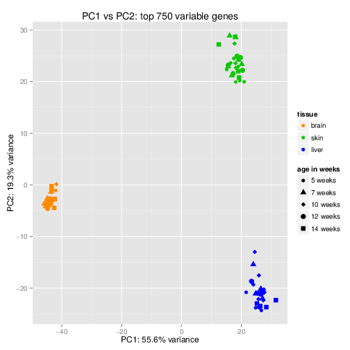

.. _linux_bash:

============================================
 Unsupervised learning
============================================

"Unsupervised learning is a type of machine learning algorithm used to draw inferences from datasets consisting of input data without labeled responses. The most common unsupervised learning method is cluster analysis, which is used for exploratory data analysis to find hidden patterns or grouping in data." `read more... <https://www.mathworks.com/discovery/unsupervised-learning.html>`_

.. image:: img/unsupervised_flowchart.png

----------------------------
Dimensionality reduction
----------------------------

Dimensionality refers to the number of variables in a data set. Problems that arise when analyzing a dataset with high-dimensionality include: computational efficiency and visualization.  By transforming our data into a smaller set of variables that still contain most of the useful information, we can reduce the run-time of performing certain machine learning tasks, as well as visually observe patterns in our data via plotting.

* **Principal Component Analysis (PCA)** is among the most commonly used dimensionality reduction method.  It transforms a high-dimensional data set into a smaller set of variables.  Each variable is associated to a weight, proportional to the relative amount of the variance of the original data set it accounts for.  The set of these features that account for an adequate proportion of the total amount of variance in the original data set are referred to as the *principal components*. 

PCA is done by performing an eigen decomposition on the covariance matrix of the original data set. The new variables and weights (loadings) are the eigen vectors and eigen values respectively of this covariance matrix.

* **Singular-value decomposition (SVD)** is similar to PCA, except that the new features and weights are calculated directly from the data matrix.  It is sometimes preferred to PCA due to the round-off errors when estimating the covariance matrix for PCA.

Read more `here <http://andrew.gibiansky.com/blog/mathematics/cool-linear-algebra-singular-value-decomposition/>`_. 

----------------------------
Clustering
----------------------------
Clustering algorithms try to divide the data samples based on some sort of similarity into different *clusters*. An example is to cluster single cell gene expression data to find tissue types.

* **Hierarchical clustering** is a clustering algorithm which estimates a tree-like structure between observations based on their relative distance, such that observations that are most similar to each other are connected at the terminal parts of the tree. The tree is most often generated using a bottom-up or *agglomerative* approach, in which samples are initially in their own clusters and then iteratively the most similar clusters are combined to create super-clusters. Alternatively, top-down hierarchical clustering is call *divisive* clustering.

.. image:: img/hierarchical_clustering.png
    :scale: 50%

.. raw:: html

    <iframe width="560" height="315" src="https://www.youtube.com/embed/7xHsRkOdVwo" frameborder="0" allow="autoplay; encrypted-media" allowfullscreen></iframe>

* **K-means** is a method to cluster the samples into K distributions with different means. The algorithm starts by choosing K random points as *means* in the feature space and assigns samples to a cluster with the closest mean (by some similarity measure). The means are iteratively moved to best fit the samples until no further improvement are made. This method is stochastic, in that the final model may differ depending on the initial random guesses.

.. image:: img/k-means.png

.. raw:: html

    <iframe width="560" height="315" src="https://www.youtube.com/embed/BVFG7fd1H30" frameborder="0" allow="autoplay; encrypted-media" allowfullscreen></iframe>
    

* **X-means** is a general K-means clustering algorithm that tries different K values to find the K that best represents the data.

The following image shows different clustering algorithm run on different data (2 dimensions).

.. image:: img/clustering.png
    :target: https://towardsdatascience.com/the-5-clustering-algorithms-data-scientists-need-to-know-a36d136ef68

Note that in all these clustering methods we talked about similarity. Similarity can be defined differently. **Euclidean distance** is the most common measure which is simply measuring the straight line distance between the two samples in the feature space.
For a detailed comparison read this article:

`Shirkhorshidi, Ali Seyed, Saeed Aghabozorgi, and Teh Ying Wah. "A comparison study on similarity and dissimilarity measures in clustering continuous data." PloS one 10.12 (2015): e0144059. <http://journals.plos.org/plosone/article?id=10.1371/journal.pone.0144059>`_

Keep in mind that *any data clusters*. Clusters obtained by any method are a way to explore the data. You can measure the *fitness* of the clustering by measuring the intra-clusters similarity vs. the in-between cluster dissimilarity. 
Commonly used measure are Silhouette coefficient and the Davies–Bouldin index.
