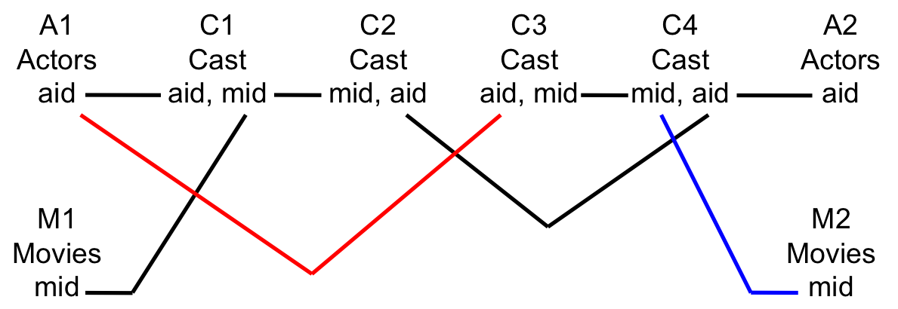

============================
Solutions to Common Queries
============================

Number of movies

.. code::

	select count(*) 
	from movies;

Number of actors

.. code::

	select count(*) 
	from actors;

Number of rows in cast

.. code::

	select count(*) 
	from cast;

Movies in a range of mid values

.. code::

	select * 
	from movies 
	where mid>112303 and mid <114000 
	limit 10;

Movies named "Frozen" (case sensitive)

.. code::

	select * 
	from movies 
	where title = "Frozen"  
	limit 10;

Movies name "frozen" (case insensitive)

.. code::

	select * 
	from movies 
	where title like "frozen"  
	limit 10;

Movies with title containing "star".

.. code::

	select * 
	from movies 
	where title like "%star%"  
	limit 10;

Movies with "adventure" in genres

.. code::

	select * 
	from movies 
	where genres like "%adventure%"  
	limit 10;

Minimum year of movies in database

.. code::

	select min(year) 
	from movies;

Maximum year of movies in database

.. code::

	select max(year) 
	from movies;

Count of movies per year

.. code::

	select year, count(year) 
	from movies 
	group by year 
	limit 20;

Average number of actors per movie (uses subquery)

.. code::

	select avg(n) 
	from (
		select count(aid) as n 
		from cast group by mid
	);

Actors in movies titled "Frozen"

.. code::

	select mid, title, year, name, role, aid 
	from movies join cast using(mid) join actors using(aid) 
	where title like "Frozen";

Movies for Emma Stone sorted descending by year

.. code::

	select name, title, year 
	from movies join cast using(mid) join actors using(aid) 
	where name="Emma Stone" 
	order by year desc;

Movies for Chris Evans sorted by title

.. code::

	select name, title, year 
	from movies join cast using(mid) join actors using(aid) 
	where name="Chris Evans" 
	order by title;

Movies for George Clooney sorted by title

.. code::

	select name, title, year 
	from movies join cast using(mid) join actors using(aid) 
	where name="George Clooney" 
	order by title;

Top actors (most movies) over 30

.. code::

	select name, count(mid) as c 
	from cast join actors using(aid) 
	group by name
	having c >= 30 
	order by c desc 
	limit 10;

Top actors (most movies) since 2015

.. code::

	select name, count(mid) 
	from movies join cast using(mid) join actors using(aid) 
	where year >= 2015 
	group by name 
	order by count(mid) desc 
	limit 10;

Same two actors in two movies (complete version, note less than (<) instead of not equal (<>) in final part of the where to avoid reversed duplicates)

 

.. code::

	select a1.name, a2.name, m1.title, m2.title 
	from actors a1 join cast c1 using (aid) 
		join cast as c2 using(mid) 
			join cast as c3 on c1.aid=c3.aid 
				join cast as c4 on c2.aid = c4.aid and c3.mid=c4.mid 
					join actors a2 on c4.aid=a2.aid 
						join movies as m1 on m1.mid=c1.mid 
							join movies as m2 on m2.mid=c4.mid 
	where c1.aid <> c2.aid and c1.mid < c3.mid 
	limit 10;
	
Same two actors in two movies, one of which is Emma Stone

.. code::

	select a1.name, a2.name, m1.title, m2.title 
	from actors a1 join cast c1 using (aid) 
		join cast as c2 using(mid) 
			join cast as c3 on c1.aid=c3.aid 
				join cast as c4 on c2.aid = c4.aid and c3.mid=c4.mid 
					join actors a2 on c4.aid=a2.aid 
						join movies as m1 on m1.mid=c1.mid 
							join movies as m2 on m2.mid=c4.mid 
	where c1.aid <> c2.aid and c1.mid < c3.mid and a1.name like "Emma Stone"
	limit 10;
	

